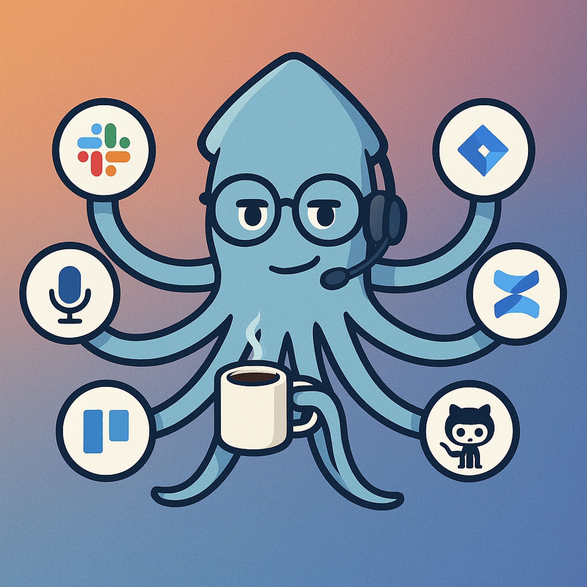

<div align="center">
  
  
  # 🐙 Squiddles: Your Voice-Powered AI Workforce
</div>

## The Vision: Extensible Intelligence That Speaks Your Language

**Squiddles** transforms how teams work by creating an **extensible AI ecosystem** where specialized "tentacles" handle different aspects of your workflow through natural voice interaction. Like an octopus using different tentacles for different tasks, Squiddles deploys AI agents tailored to your specific needs.

---

## 🎯 **The Problem We Solve**

### Traditional AI Assistants Are Limited
- **One-size-fits-all approach** doesn't match specialized workflows
- **Context switching friction** between different tools and systems
- **No customization** for domain-specific terminology and processes
- **Fragmented experience** across different platforms and integrations

### What Teams Actually Need
- **Specialized AI agents** that understand their specific domain
- **Seamless integration** with existing tools (Jira, Slack, Confluence)
- **Voice-first interaction** for natural, hands-free productivity
- **Extensible system** that grows with team needs

---

## 🐙 **The Squiddles Solution**

### Core Architecture: The Extensible Tentacle System
```
🧠 Central Brain (Orchestrator)
├── 📋 Product Manager Tentacle (User Stories, Requirements)
├── 💬 Slack Integration Tentacle (Team Communication)
├── 🎫 Jira Automation Tentacle (Ticket Management)
├── 📊 Data Analysis Tentacle (Insights, Reporting)
├── 📝 Documentation Tentacle (Confluence, Wikis)
└── 🔧 Custom Tentacles (Your Specific Needs)
```

### Key Innovation: Voice-Driven Tentacle Orchestration
- **Natural language routing**: "Create a user story and tell the team about it"
- **Automatic handoffs**: Brain routes to ProductManager → Jira → Slack tentacles
- **Context preservation**: Full conversation history travels between tentacles
- **Intelligent collaboration**: Tentacles work together seamlessly

---

## 🚀 **Target Market & Use Cases**

### Primary Market: Technical Product Teams
**Product Managers | Engineering Leads | Scrum Masters | Technical Founders**

#### Use Case 1: AI-Assisted User Story Creation
*"Create a user story for two-factor authentication with security requirements and acceptance criteria"*
- **ProductManager Tentacle** structures the story using company templates
- **Security Tentacle** adds compliance requirements
- **Jira Tentacle** creates ticket with proper labels and assignments
- **Slack Tentacle** notifies relevant team members

#### Use Case 2: Sprint Planning Automation
*"Analyze last sprint's velocity and suggest stories for next sprint"*
- **DataAnalysis Tentacle** pulls Jira metrics and team capacity
- **ProductManager Tentacle** recommends story prioritization
- **Planning Tentacle** creates draft sprint with effort estimates
- **Calendar Tentacle** schedules planning meetings

#### Use Case 3: Cross-Team Communication
*"Update all stakeholders on the API deprecation timeline"*
- **Documentation Tentacle** pulls technical details from Confluence
- **Communication Tentacle** crafts stakeholder-appropriate messaging
- **Slack Tentacle** posts to relevant channels
- **Email Tentacle** sends formal notifications to external partners

---

## 💰 **Business Model & Market Opportunity**

### Market Size
- **Productivity Software**: $47B market (growing 13% annually)
- **AI in Enterprise**: $6.8B market (growing 37% annually)
- **Voice AI**: $2.8B market (growing 24% annually)

### Revenue Streams
1. **SaaS Subscriptions**: Per-user monthly pricing
   - Starter: $29/user/month (3 tentacles)
   - Professional: $79/user/month (10 tentacles)
   - Enterprise: $149/user/month (unlimited tentacles)

2. **Custom Tentacle Development**: $5K-$25K per custom tentacle
3. **Integration Services**: $10K-$50K for complex enterprise integrations
4. **Training & Consulting**: $200/hour for team onboarding

### Unit Economics
- **Customer Acquisition Cost**: $150 (Product-led growth + word-of-mouth)
- **Lifetime Value**: $8,400 (Professional tier, 24-month retention)
- **LTV/CAC Ratio**: 56:1 (Excellent SaaS metrics)

---

## 🏆 **Competitive Advantages**

### 1. **Extensibility-First Architecture**
Unlike monolithic AI assistants, Squiddles grows with your team's needs. Add new tentacles without changing core system.

### 2. **Voice-Native Experience**
While others bolt voice onto text interfaces, Squiddles is built voice-first for natural interaction.

### 3. **Context-Aware Handoffs**
Seamless transition between specialized agents maintains conversation flow and context.

### 4. **Domain Expertise**
Tentacles understand industry-specific terminology, processes, and best practices.

### 5. **Integration Depth**
Native integrations with team tools, not just API connections.

---

## 📊 **Go-to-Market Strategy**

### Phase 1: Product-Led Growth (Months 1-6)
- **Target**: Technical Product Managers and Engineering Leads
- **Strategy**: Free trial → Self-service conversion
- **Channels**: Product Hunt, Twitter, LinkedIn, Dev communities
- **Goal**: 100 paying customers, $50K MRR

### Phase 2: Sales-Assisted Growth (Months 7-18)
- **Target**: Mid-market teams (50-500 employees)
- **Strategy**: Inside sales + customer success
- **Channels**: Conferences, webinars, partner referrals
- **Goal**: 500 paying customers, $300K MRR

### Phase 3: Enterprise Expansion (Months 19+)
- **Target**: Enterprise accounts (500+ employees)
- **Strategy**: Enterprise sales + custom tentacle development
- **Channels**: Direct sales, reseller partnerships
- **Goal**: 50 enterprise accounts, $2M+ ARR

---

## 🛠 **Product Roadmap**

### Q1 2025: MVP Launch
- ✅ Core tentacle architecture
- ✅ ProductManager tentacle (user stories)
- ✅ Jira integration tentacle
- ✅ Voice interface with OpenAI Realtime API
- ✅ Web application (Next.js)

### Q2 2025: Integration Expansion
- 📅 Slack tentacle (team communication)
- 📅 Confluence tentacle (documentation)
- 📅 Calendar tentacle (meeting management)
- 📅 Email tentacle (external communication)
- 📅 Mobile app (iOS/Android)

### Q3 2025: Intelligence & Analytics
- 📅 DataAnalysis tentacle (reporting, insights)
- 📅 Predictive analytics for sprint planning
- 📅 Team performance insights
- 📅 Custom dashboard creation
- 📅 API for third-party integrations

### Q4 2025: Enterprise Features
- 📅 Custom tentacle marketplace
- 📅 Enterprise security & compliance
- 📅 Multi-tenant architecture
- 📅 Advanced workflow automation
- 📅 White-label solutions

---

## 👥 **Team & Execution**

### Core Team Needed
- **CEO/Founder**: Product vision, fundraising, go-to-market
- **CTO**: Architecture, AI systems, platform scalability
- **Head of Product**: User experience, product-market fit
- **Senior Engineers** (2-3): Full-stack development, AI integration
- **Head of Sales**: Enterprise sales, customer success
- **Marketing Lead**: Growth, content, community building

### Funding Requirements
- **Seed Round**: $1.5M (18-month runway)
  - Product development: $800K
  - Go-to-market: $400K
  - Operations: $300K
- **Series A**: $8M (scale to $5M ARR)

---

## 🎯 **Why Now? Market Timing**

### Technology Convergence
- **OpenAI Realtime API**: Enables low-latency voice interactions
- **LLM Reliability**: GPT-4 level models now suitable for production workflows
- **Voice Interface Adoption**: Teams comfortable with voice-first tools post-COVID
- **Integration APIs**: Mature APIs from Slack, Jira, Confluence enable deep integrations

### Market Readiness
- **Remote Work**: Teams need better async communication tools
- **AI Adoption**: Enterprises actively seeking AI productivity solutions
- **Workflow Complexity**: Growing need for specialized, integrated solutions
- **Developer Tools**: Strong demand for tools that improve developer productivity

---

## 🚀 **Call to Action**

### For Investors
*"Join us in building the future of AI-powered team productivity. Squiddles represents a $100M+ opportunity in the rapidly growing AI productivity market."*

### For Customers
*"Transform your team's productivity with AI tentacles that understand your workflow. Start with our Product Manager tentacle and expand as you grow."*

### For Partners
*"Integrate your tools with Squiddles to reach thousands of productive teams. Our tentacle marketplace creates new revenue opportunities for tool makers."*

---

**Ready to unleash your team's potential with Squiddles?**

📧 **Contact**: hello@squiddles.ai  
🌐 **Website**: www.squiddles.ai  
🐦 **Twitter**: @SquiddlesAI  
💼 **LinkedIn**: /company/squiddles-ai

*🐙 Squiddles: Where every tentacle is a superpower*