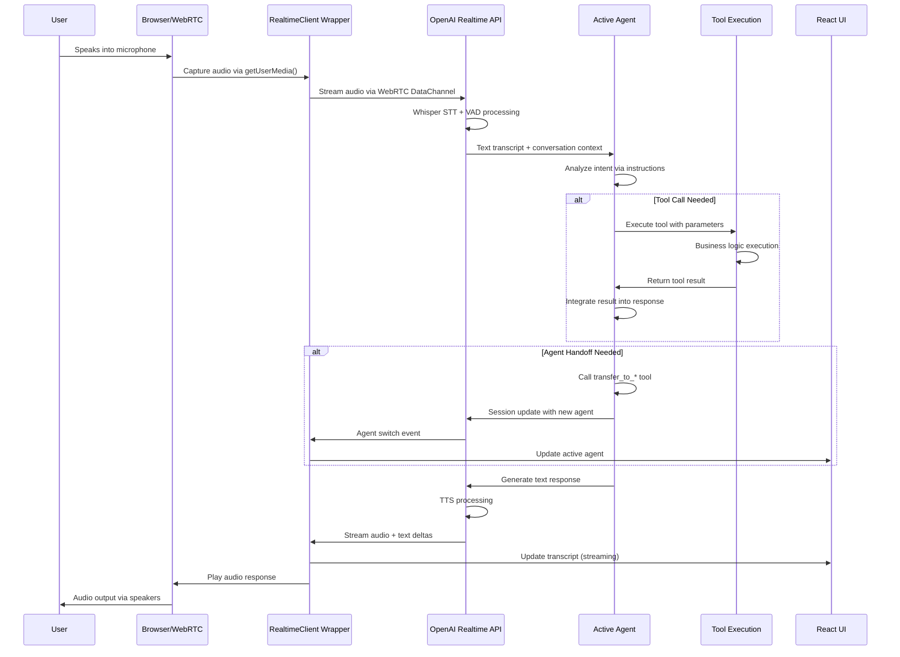

# Advanced Architecture Deep-Dive
## OpenAI Advanced Agent Example

This document provides an in-depth technical analysis of the system architecture for experienced developers who need to understand the internals.

---

## Table of Contents

1. [Complete Request-Response Flow](#complete-request-response-flow)
2. [WebRTC Integration Details](#webrtc-integration-details)
3. [Agent SDK Integration](#agent-sdk-integration)
4. [Event System Architecture](#event-system-architecture)
5. [State Management Internals](#state-management-internals)
6. [Tool Execution Engine](#tool-execution-engine)
7. [Handoff Mechanism Internals](#handoff-mechanism-internals)
8. [Audio Processing Pipeline](#audio-processing-pipeline)
9. [Error Handling & Recovery](#error-handling--recovery)
10. [Performance & Optimization](#performance--optimization)

---

## Complete Request-Response Flow

### End-to-End Technical Flow



### Critical Code Paths

**Audio Capture & Transport:**
```typescript
// src/app/agentConfigs/realtimeClient.ts
const transport = new OpenAIRealtimeWebRTC({
  useInsecureApiKey: true,
  audioElement: this.#options.audioElement,
});

this.#session = new RealtimeSession(rootAgent, {
  transport: transport,
  outputGuardrails: [moderationGuardrail],
  context: this.#options.extraContext ?? {},
});
```

**Event Processing Loop:**
```typescript
// Real-time event forwarding
transport.on('*', (ev: any) => {
  this.#events.emit('message', ev);
});

// Connection state tracking
transport.on('connection.state.change', (state: any) => {
  if (state === 'connected') {
    this.#events.emit('connection_change', 'connected');
  } else if (state === 'disconnected') {
    this.#events.emit('connection_change', 'disconnected');
  }
});
```

---

## WebRTC Integration Details

### Transport Layer Architecture

**WebRTC Configuration:**
```typescript
// OpenAI's WebRTC implementation details
interface OpenAIRealtimeWebRTCConfig {
  useInsecureApiKey: boolean;      // Development mode
  audioElement: HTMLAudioElement;  // Output audio element
  dataChannelLabel?: string;       // Default: "oai-events"
}

// Internal WebRTC setup (abstracted by OpenAI SDK)
const rtcConnection = new RTCPeerConnection({
  iceServers: [{ urls: 'stun:stun.l.google.com:19302' }]
});
```

**Audio Constraints & Processing:**
```typescript
// Microphone capture configuration
const microphoneConstraints = {
  audio: {
    echoCancellation: true,
    noiseSuppression: true,
    autoGainControl: true,
    sampleRate: 24000,        // OpenAI Realtime API requirement
    channelCount: 1           // Mono audio
  }
};

// Audio element management
const audioElement = document.createElement('audio');
audioElement.autoplay = true;     // Required for real-time playback
audioElement.style.display = 'none';
document.body.appendChild(audioElement);
```

### Data Channel Communication

**Event Streaming Protocol:**
```typescript
// Events sent over WebRTC DataChannel
interface RealtimeEvent {
  type: string;
  [key: string]: any;
}

// Example events flowing through the data channel:
{
  type: "conversation.item.create",
  item: {
    type: "message",
    role: "user",
    content: [{ type: "input_audio", audio: "base64..." }]
  }
}

{
  type: "response.create",
  response: {
    modalities: ["text", "audio"],
    instructions: "You are a helpful assistant"
  }
}
```

---

## Agent SDK Integration

### RealtimeAgent Class Internals

**Agent Registration Process:**
```typescript
// Agent initialization with SDK
export class RealtimeAgent {
  constructor(config: {
    name: string;
    voice?: string;
    instructions: string;
    tools: Tool[];
    handoffs: RealtimeAgent[];
    handoffDescription?: string;
  }) {
    this.name = config.name;
    this.instructions = config.instructions;
    this.tools = this.processTools(config.tools);
    this.handoffs = this.createHandoffTools(config.handoffs);
  }
  
  private createHandoffTools(handoffs: RealtimeAgent[]): Tool[] {
    return handoffs.map(agent => ({
      type: 'function',
      name: `transfer_to_${agent.name}`,
      description: `Transfer to ${agent.handoffDescription || agent.name}`,
      parameters: { type: 'object', properties: {} },
      handler: () => this.executeHandoff(agent)
    }));
  }
}
```

**Session Management:**
```typescript
// RealtimeSession coordinates multiple agents
export class RealtimeSession {
  private activeAgent: RealtimeAgent;
  private availableAgents: Map<string, RealtimeAgent>;
  private conversationHistory: RealtimeItem[];
  
  constructor(rootAgent: RealtimeAgent, config: SessionConfig) {
    this.activeAgent = rootAgent;
    this.availableAgents = new Map();
    this.registerAgent(rootAgent);
    
    // Register all handoff targets
    this.registerHandoffAgents(rootAgent);
  }
  
  private registerHandoffAgents(agent: RealtimeAgent): void {
    agent.handoffs.forEach(handoffAgent => {
      if (!this.availableAgents.has(handoffAgent.name)) {
        this.availableAgents.set(handoffAgent.name, handoffAgent);
        this.registerHandoffAgents(handoffAgent); // Recursive registration
      }
    });
  }
}
```

### Tool Integration Deep-Dive

**Tool Execution Context:**
```typescript
interface ToolExecutionContext {
  agentName: string;
  conversationHistory: RealtimeItem[];
  sessionMetadata: Record<string, any>;
  userContext?: Record<string, any>;
}

// Tool execution with full context
const executeTool = async (
  tool: Tool, 
  parameters: any, 
  context: ToolExecutionContext
): Promise<any> => {
  try {
    const startTime = performance.now();
    
    const result = await tool.execute(parameters, {
      context: {
        history: context.conversationHistory,
        agentName: context.agentName,
        metadata: context.sessionMetadata
      }
    });
    
    const duration = performance.now() - startTime;
    
    // Log tool performance
    console.log(`Tool ${tool.name} executed in ${duration}ms`);
    
    return result;
  } catch (error) {
    console.error(`Tool ${tool.name} failed:`, error);
    throw error;
  }
};
```

---

## Event System Architecture

### Event Flow Management

**Event Types Hierarchy:**
```typescript
// Core event types in the system
interface EventTypes {
  // Connection events
  'connection.state.change': [string];
  'session.created': [SessionInfo];
  'session.updated': [SessionUpdate];
  
  // Conversation events
  'conversation.item.created': [ConversationItem];
  'conversation.item.truncated': [TruncationInfo];
  'conversation.item.deleted': [string]; // item_id
  
  // Input events
  'input_audio_buffer.speech_started': [SpeechStart];
  'input_audio_buffer.speech_stopped': [SpeechStop];
  'conversation.input_audio_transcription.delta': [TranscriptionDelta];
  'conversation.input_audio_transcription.completed': [TranscriptionComplete];
  
  // Response events
  'response.created': [ResponseInfo];
  'response.done': [ResponseComplete];
  'response.text.delta': [TextDelta];
  'response.audio.delta': [AudioDelta];
  'response.audio_transcript.delta': [AudioTranscriptDelta];
  
  // Function call events
  'response.function_call_delta': [FunctionCallDelta];
  'response.function_call.done': [FunctionCallComplete];
  
  // Error events
  'error': [ErrorInfo];
  'rate_limits.updated': [RateLimitInfo];
}
```

**Event Processing Pipeline:**
```typescript
// src/app/App.tsx - Main event handler
const handleRealtimeEvent = useCallback((event: any) => {
  // Log all events for debugging
  logServerEvent(event);
  
  // Process by event type
  switch (event.type) {
    case 'conversation.input_audio_transcription.delta':
      handleUserTranscriptionDelta(event);
      break;
      
    case 'response.text.delta':
    case 'response.audio_transcript.delta':
      handleAssistantResponseDelta(event);
      break;
      
    case 'response.function_call_delta':
      handleToolCallDelta(event);
      break;
      
    case 'session.updated':
      handleSessionUpdate(event);
      break;
      
    case 'error':
      handleError(event);
      break;
      
    default:
      // Handle unknown event types
      console.warn('Unhandled event type:', event.type);
  }
}, []);
```

### Streaming State Management

**Delta Processing for Real-time Updates:**
```typescript
// Handle streaming text updates
const handleAssistantResponseDelta = (event: TextDelta) => {
  const itemId = event.item_id;
  const delta = event.delta;
  
  setTranscriptItems(prev => {
    const existing = prev.find(item => item.itemId === itemId);
    
    if (!existing) {
      // Create new message
      return [...prev, {
        itemId,
        role: 'assistant',
        text: delta,
        timestamp: new Date(),
        isStreaming: true
      }];
    } else {
      // Append to existing message
      return prev.map(item => 
        item.itemId === itemId 
          ? { ...item, text: item.text + delta }
          : item
      );
    }
  });
};

// Handle streaming completion
const handleResponseDone = (event: ResponseComplete) => {
  setTranscriptItems(prev =>
    prev.map(item =>
      item.itemId === event.response.output[0]?.id
        ? { ...item, isStreaming: false }
        : item
    )
  );
};
```

---

## State Management Internals

### React Context Architecture

**TranscriptContext Implementation:**
```typescript
// src/app/contexts/TranscriptContext.tsx
interface TranscriptContextType {
  transcriptItems: TranscriptItem[];
  addTranscriptMessage: (itemId: string, role: 'user' | 'assistant', text: string) => void;
  updateTranscriptMessage: (itemId: string, text: string, isDelta: boolean) => void;
  addTranscriptBreadcrumb: (title: string, data?: any) => void;
  clearTranscript: () => void;
}

const TranscriptProvider: React.FC<{ children: React.ReactNode }> = ({ children }) => {
  const [transcriptItems, setTranscriptItems] = useState<TranscriptItem[]>([]);
  const transcriptItemsRef = useRef<TranscriptItem[]>([]);
  
  // Keep ref in sync for event handlers
  useEffect(() => {
    transcriptItemsRef.current = transcriptItems;
  }, [transcriptItems]);
  
  const addTranscriptMessage = useCallback((itemId: string, role: 'user' | 'assistant', text: string) => {
    const newItem: TranscriptItem = {
      itemId,
      role,
      text,
      timestamp: new Date(),
      type: 'message'
    };
    
    setTranscriptItems(prev => [...prev, newItem]);
  }, []);
  
  // ... other methods
};
```

**EventContext for Debugging:**
```typescript
// src/app/contexts/EventContext.tsx
interface LoggedEvent {
  id: string;
  timestamp: Date;
  type: 'client' | 'server';
  event: any;
  suffix?: string;
}

const EventProvider: React.FC<{ children: React.ReactNode }> = ({ children }) => {
  const [loggedEvents, setLoggedEvents] = useState<LoggedEvent[]>([]);
  
  const logClientEvent = useCallback((event: any, suffix?: string) => {
    const loggedEvent: LoggedEvent = {
      id: generateId(),
      timestamp: new Date(),
      type: 'client',
      event: JSON.parse(JSON.stringify(event)), // Deep clone
      suffix
    };
    
    setLoggedEvents(prev => [loggedEvent, ...prev.slice(0, 999)]); // Keep last 1000
  }, []);
  
  // ... similar for server events
};
```

### Local Storage Integration

**Persistent UI State:**
```typescript
// Persist user preferences
const usePersistentState = <T>(key: string, defaultValue: T): [T, (value: T) => void] => {
  const [state, setState] = useState<T>(() => {
    if (typeof window === 'undefined') return defaultValue;
    
    try {
      const item = localStorage.getItem(key);
      return item ? JSON.parse(item) : defaultValue;
    } catch {
      return defaultValue;
    }
  });
  
  const setValue = useCallback((value: T) => {
    setState(value);
    localStorage.setItem(key, JSON.stringify(value));
  }, [key]);
  
  return [state, setValue];
};

// Usage in components
const [isPTTActive, setIsPTTActive] = usePersistentState('claude-ptt-mode', false);
const [isAudioMuted, setIsAudioMuted] = usePersistentState('claude-audio-muted', false);
const [isLogsExpanded, setIsLogsExpanded] = usePersistentState('claude-logs-expanded', false);
```

---

## Tool Execution Engine

### Tool Definition & Registration

**Tool Interface:**
```typescript
interface Tool {
  name: string;
  description: string;
  parameters: JSONSchema;
  execute: (input: any, context?: ToolContext) => Promise<any>;
}

interface ToolContext {
  context?: {
    history: RealtimeItem[];
    agentName: string;
    metadata: Record<string, any>;
  };
}
```

**Tool Execution Pipeline:**
```typescript
class ToolExecutor {
  private tools: Map<string, Tool> = new Map();
  
  registerTool(tool: Tool): void {
    this.tools.set(tool.name, tool);
  }
  
  async executeTool(
    toolName: string, 
    parameters: any, 
    context: ToolContext
  ): Promise<any> {
    const tool = this.tools.get(toolName);
    if (!tool) {
      throw new Error(`Tool ${toolName} not found`);
    }
    
    // Validate parameters against schema
    const isValid = this.validateParameters(parameters, tool.parameters);
    if (!isValid) {
      throw new Error(`Invalid parameters for tool ${toolName}`);
    }
    
    // Execute with timeout
    const timeoutPromise = new Promise((_, reject) =>
      setTimeout(() => reject(new Error('Tool execution timeout')), 30000)
    );
    
    const executionPromise = tool.execute(parameters, context);
    
    return Promise.race([executionPromise, timeoutPromise]);
  }
  
  private validateParameters(parameters: any, schema: JSONSchema): boolean {
    // JSON Schema validation logic
    return true; // Simplified
  }
}
```

### Advanced Tool Patterns

**Supervisor Tool Implementation:**
```typescript
// src/app/agentConfigs/chatSupervisor/supervisorAgent.ts
export const getNextResponseFromSupervisor = tool({
  name: 'getNextResponseFromSupervisor',
  description: 'Get intelligent guidance from supervisor agent',
  parameters: {
    type: 'object',
    properties: {
      relevantContextFromLastUserMessage: {
        type: 'string',
        description: 'Key information extracted from user message'
      }
    },
    required: ['relevantContextFromLastUserMessage']
  },
  execute: async (input, details) => {
    const history: RealtimeItem[] = (details?.context as any)?.history ?? [];
    
    // Convert conversation history to supervisor format
    const supervisorMessages = history
      .filter(item => item.type === 'message')
      .map(item => ({
        role: item.role,
        content: extractTextContent(item.content)
      }));
    
    // Call supervisor via OpenAI Responses API
    const body = {
      model: 'gpt-4.1',
      input: [
        {
          type: 'message',
          role: 'system',
          content: supervisorAgentInstructions
        },
        ...supervisorMessages
      ],
      tools: supervisorAgentTools
    };
    
    const response = await fetch('/api/responses', {
      method: 'POST',
      headers: { 'Content-Type': 'application/json' },
      body: JSON.stringify(body)
    });
    
    const result = await response.json();
    return { nextResponse: result.content };
  }
});
```

**Database Integration Tool:**
```typescript
const lookupCustomerOrder = tool({
  name: 'lookupCustomerOrderByPhone',
  description: 'Find customer order using phone number',
  parameters: {
    type: 'object',
    properties: {
      phone: {
        type: 'string',
        pattern: '^\\(\\d{3}\\) \\d{3}-\\d{4}$',
        description: 'Phone number in format (xxx) xxx-xxxx'
      }
    },
    required: ['phone']
  },
  execute: async (input) => {
    // Simulate database lookup
    const orders = [
      {
        id: 'ORD-2024-001',
        phone: '(555) 123-4567',
        items: [{ name: 'Alpine Snowboard', price: 499.99 }],
        status: 'shipped',
        orderDate: '2024-01-15'
      }
    ];
    
    const order = orders.find(o => o.phone === input.phone);
    
    if (!order) {
      return {
        found: false,
        message: 'No order found for this phone number'
      };
    }
    
    return {
      found: true,
      order: {
        orderId: order.id,
        status: order.status,
        items: order.items,
        orderDate: order.orderDate
      }
    };
  }
});
```

---

## Handoff Mechanism Internals

### Transfer Tool Generation

**Automatic Handoff Tool Creation:**
```typescript
// Internal SDK logic for creating transfer tools
class RealtimeAgent {
  private generateHandoffTools(handoffs: RealtimeAgent[]): Tool[] {
    return handoffs.map(targetAgent => ({
      name: `transfer_to_${targetAgent.name}`,
      description: `Transfer conversation to ${targetAgent.handoffDescription || targetAgent.name}`,
      parameters: {
        type: 'object',
        properties: {
          reason: {
            type: 'string',
            description: 'Brief reason for the transfer'
          }
        }
      },
      execute: async (input) => {
        // Handoff execution handled by SDK
        return this.executeHandoff(targetAgent, input.reason);
      }
    }));
  }
  
  private async executeHandoff(targetAgent: RealtimeAgent, reason?: string): Promise<any> {
    // Session update to switch active agent
    const handoffEvent = {
      type: 'session.update',
      session: {
        instructions: targetAgent.instructions,
        tools: [...targetAgent.tools, ...targetAgent.handoffTools],
        voice: targetAgent.voice
      }
    };
    
    // Emit handoff event for UI
    this.emit('agent_handoff', {
      fromAgent: this.name,
      toAgent: targetAgent.name,
      reason
    });
    
    return { success: true, newAgent: targetAgent.name };
  }
}
```

### Session State Transitions

**Agent Context Switching:**
```typescript
// Frontend handoff detection and processing
const detectAndHandleHandoff = (event: any) => {
  if (event.type === 'response.function_call_delta' || event.type === 'response.function_call.done') {
    const toolName = event.name || event.function_name;
    const handoffMatch = toolName?.match(/^transfer_to_(.+)$/);
    
    if (handoffMatch) {
      const newAgentName = handoffMatch[1];
      
      // Find target agent in current scenario
      const targetAgent = selectedAgentConfigSet?.find(
        agent => agent.name.toLowerCase() === newAgentName.toLowerCase()
      );
      
      if (targetAgent && targetAgent.name !== selectedAgentName) {
        // Add handoff breadcrumb
        addTranscriptBreadcrumb(`🔄 Transferred to ${targetAgent.name}`, {
          fromAgent: selectedAgentName,
          toAgent: targetAgent.name,
          timestamp: new Date()
        });
        
        // Update active agent
        setSelectedAgentName(targetAgent.name);
        
        // Log handoff event
        logClientEvent({
          type: 'agent_handoff',
          fromAgent: selectedAgentName,
          toAgent: targetAgent.name
        });
      }
    }
  }
};
```

### Context Preservation Strategy

**Conversation History Management:**
```typescript
// How conversation context is preserved during handoffs
interface ConversationContext {
  messages: Message[];
  userProfile: UserProfile;
  sessionMetadata: SessionMetadata;
  agentNotes: Record<string, any>;
}

const preserveContextDuringHandoff = (
  currentContext: ConversationContext,
  newAgent: RealtimeAgent
): ConversationContext => {
  // Full history preservation
  const preservedContext = {
    ...currentContext,
    agentNotes: {
      ...currentContext.agentNotes,
      [newAgent.name]: {
        handoffTime: new Date(),
        previousAgent: currentContext.activeAgent,
        reason: 'User request routed to specialist'
      }
    }
  };
  
  return preservedContext;
};
```

---

## Audio Processing Pipeline

### WebRTC Audio Flow

**Audio Capture Configuration:**
```typescript
// Optimized microphone settings for voice AI
const getOptimalAudioConstraints = (): MediaStreamConstraints => ({
  audio: {
    echoCancellation: true,      // Remove echo from speakers
    noiseSuppression: true,      // Filter background noise
    autoGainControl: true,       // Normalize volume levels
    sampleRate: 24000,          // OpenAI Realtime API requirement
    channelCount: 1,            // Mono audio
    latency: 0.02,              // 20ms latency target
    volume: 1.0                 // Full volume
  }
});

// Audio element setup for optimal playback
const configureAudioElement = (element: HTMLAudioElement): void => {
  element.autoplay = true;       // Start playback immediately
  element.playsInline = true;    // Mobile compatibility
  element.muted = false;         // Ensure audio plays
  element.volume = 1.0;          // Full volume
  
  // Handle audio events
  element.addEventListener('loadstart', () => {
    console.log('Audio loading started');
  });
  
  element.addEventListener('canplay', () => {
    console.log('Audio ready to play');
  });
  
  element.addEventListener('error', (e) => {
    console.error('Audio playback error:', e);
  });
};
```

### Advanced Recording Implementation

**Multi-Stream Audio Recording:**
```typescript
// src/app/hooks/useAudioDownload.ts
class AudioRecorder {
  private mediaRecorder: MediaRecorder | null = null;
  private recordedChunks: Blob[] = [];
  private audioContext: AudioContext | null = null;
  
  async startRecording(remoteStream: MediaStream): Promise<void> {
    try {
      // Get user microphone
      const micStream = await navigator.mediaDevices.getUserMedia({
        audio: getOptimalAudioConstraints().audio
      });
      
      // Create audio context for mixing
      this.audioContext = new AudioContext({ sampleRate: 48000 });
      const destination = this.audioContext.createMediaStreamDestination();
      
      // Create sources for both streams
      const remoteSource = this.audioContext.createMediaStreamSource(remoteStream);
      const micSource = this.audioContext.createMediaStreamSource(micStream);
      
      // Create gain nodes for volume control
      const remoteGain = this.audioContext.createGain();
      const micGain = this.audioContext.createGain();
      
      remoteGain.gain.value = 1.0;  // Assistant audio
      micGain.gain.value = 0.8;     // User audio (slightly lower)
      
      // Connect the audio graph
      remoteSource.connect(remoteGain).connect(destination);
      micSource.connect(micGain).connect(destination);
      
      // Start recording mixed audio
      this.mediaRecorder = new MediaRecorder(destination.stream, {
        mimeType: 'audio/webm;codecs=opus',
        audioBitsPerSecond: 128000
      });
      
      this.mediaRecorder.ondataavailable = (event) => {
        if (event.data.size > 0) {
          this.recordedChunks.push(event.data);
        }
      };
      
      this.mediaRecorder.start(1000); // 1 second chunks
      
    } catch (error) {
      console.error('Failed to start recording:', error);
      throw error;
    }
  }
  
  async stopRecording(): Promise<Blob> {
    return new Promise((resolve, reject) => {
      if (!this.mediaRecorder) {
        reject(new Error('No active recording'));
        return;
      }
      
      this.mediaRecorder.onstop = () => {
        const recordedBlob = new Blob(this.recordedChunks, {
          type: 'audio/webm'
        });
        
        // Clean up
        this.recordedChunks = [];
        if (this.audioContext) {
          this.audioContext.close();
          this.audioContext = null;
        }
        
        resolve(recordedBlob);
      };
      
      this.mediaRecorder.stop();
    });
  }
}
```

### Audio Format Conversion

**WebM to WAV Conversion:**
```typescript
const convertWebMToWAV = async (webmBlob: Blob): Promise<Blob> => {
  const audioContext = new AudioContext();
  
  try {
    // Decode WebM audio data
    const arrayBuffer = await webmBlob.arrayBuffer();
    const audioBuffer = await audioContext.decodeAudioData(arrayBuffer);
    
    // Convert to WAV format
    const wavData = audioBufferToWAV(audioBuffer);
    const wavBlob = new Blob([wavData], { type: 'audio/wav' });
    
    return wavBlob;
  } finally {
    audioContext.close();
  }
};

const audioBufferToWAV = (buffer: AudioBuffer): ArrayBuffer => {
  const length = buffer.length;
  const sampleRate = buffer.sampleRate;
  const numberOfChannels = buffer.numberOfChannels;
  
  const arrayBuffer = new ArrayBuffer(44 + length * numberOfChannels * 2);
  const view = new DataView(arrayBuffer);
  
  // WAV header
  const writeString = (offset: number, string: string) => {
    for (let i = 0; i < string.length; i++) {
      view.setUint8(offset + i, string.charCodeAt(i));
    }
  };
  
  writeString(0, 'RIFF');
  view.setUint32(4, 36 + length * numberOfChannels * 2, true);
  writeString(8, 'WAVE');
  writeString(12, 'fmt ');
  view.setUint32(16, 16, true);
  view.setUint16(20, 1, true);
  view.setUint16(22, numberOfChannels, true);
  view.setUint32(24, sampleRate, true);
  view.setUint32(28, sampleRate * numberOfChannels * 2, true);
  view.setUint16(32, numberOfChannels * 2, true);
  view.setUint16(34, 16, true);
  writeString(36, 'data');
  view.setUint32(40, length * numberOfChannels * 2, true);
  
  // Convert audio data
  let offset = 44;
  for (let i = 0; i < length; i++) {
    for (let channel = 0; channel < numberOfChannels; channel++) {
      const sample = Math.max(-1, Math.min(1, buffer.getChannelData(channel)[i]));
      view.setInt16(offset, sample * 0x7FFF, true);
      offset += 2;
    }
  }
  
  return arrayBuffer;
};
```

---

## Error Handling & Recovery

### Connection Recovery Strategies

**Automatic Reconnection Logic:**
```typescript
class ConnectionManager {
  private reconnectAttempts = 0;
  private maxReconnectAttempts = 5;
  private reconnectDelay = 1000; // Start with 1 second
  
  async handleConnectionLoss(): Promise<void> {
    console.log('Connection lost, attempting recovery...');
    
    while (this.reconnectAttempts < this.maxReconnectAttempts) {
      try {
        await this.attemptReconnection();
        console.log('Connection recovered successfully');
        this.reconnectAttempts = 0;
        this.reconnectDelay = 1000;
        return;
      } catch (error) {
        this.reconnectAttempts++;
        console.log(`Reconnection attempt ${this.reconnectAttempts} failed:`, error);
        
        if (this.reconnectAttempts < this.maxReconnectAttempts) {
          await this.sleep(this.reconnectDelay);
          this.reconnectDelay *= 2; // Exponential backoff
        }
      }
    }
    
    console.error('Failed to recover connection after maximum attempts');
    this.handlePermanentConnectionLoss();
  }
  
  private async attemptReconnection(): Promise<void> {
    // Get fresh ephemeral key
    const newKey = await fetch('/api/session').then(r => r.text());
    
    // Recreate client with new key
    const client = new RealtimeClient({
      getEphemeralKey: () => newKey,
      initialAgents: this.currentAgents,
      audioElement: this.audioElement
    });
    
    await client.connect();
    this.client = client;
  }
  
  private handlePermanentConnectionLoss(): void {
    // Notify user and provide fallback options
    alert('Connection lost. Please refresh the page to continue.');
  }
  
  private sleep(ms: number): Promise<void> {
    return new Promise(resolve => setTimeout(resolve, ms));
  }
}
```

### Graceful Degradation

**Fallback Strategies:**
```typescript
class GracefulDegradation {
  private fallbackModes = {
    FULL_VOICE: 'full_voice',      // Normal operation
    AUDIO_ONLY: 'audio_only',      // No transcript display
    TEXT_ONLY: 'text_only',        // No voice, text chat only
    OFFLINE: 'offline'             // Local processing only
  };
  
  private currentMode = this.fallbackModes.FULL_VOICE;
  
  async handleFeatureFailure(feature: string, error: Error): Promise<void> {
    console.warn(`Feature ${feature} failed:`, error);
    
    switch (feature) {
      case 'voice_recognition':
        await this.fallbackToTextInput();
        break;
        
      case 'voice_synthesis':
        await this.fallbackToTextOutput();
        break;
        
      case 'realtime_connection':
        await this.fallbackToPollingMode();
        break;
        
      case 'tool_execution':
        await this.fallbackToStaticResponses();
        break;
        
      default:
        console.error(`Unknown feature failure: ${feature}`);
    }
  }
  
  private async fallbackToTextInput(): Promise<void> {
    this.currentMode = this.fallbackModes.TEXT_ONLY;
    
    // Show text input interface
    const textInput = document.createElement('input');
    textInput.type = 'text';
    textInput.placeholder = 'Type your message (voice unavailable)';
    textInput.addEventListener('keypress', (e) => {
      if (e.key === 'Enter') {
        this.handleTextInput(textInput.value);
        textInput.value = '';
      }
    });
    
    document.body.appendChild(textInput);
  }
  
  private async fallbackToStaticResponses(): Promise<void> {
    // Use pre-defined responses when tools fail
    const staticResponses = {
      'greeting': 'Hello! I apologize, but some features are currently unavailable. How can I help you?',
      'error': 'I apologize, but I\'m experiencing technical difficulties. Please try again later.',
      'help': 'I can still help with basic questions. What would you like to know?'
    };
    
    // Replace tool calls with static responses
    this.useStaticResponseMode(staticResponses);
  }
}
```

### Error Monitoring & Reporting

**Comprehensive Error Tracking:**
```typescript
class ErrorMonitor {
  private errorQueue: ErrorReport[] = [];
  private maxQueueSize = 100;
  
  reportError(error: Error, context: ErrorContext): void {
    const errorReport: ErrorReport = {
      id: generateId(),
      timestamp: new Date(),
      error: {
        name: error.name,
        message: error.message,
        stack: error.stack
      },
      context: {
        agentName: context.agentName,
        toolName: context.toolName,
        sessionId: context.sessionId,
        userAgent: navigator.userAgent,
        url: window.location.href
      },
      severity: this.determineSeverity(error)
    };
    
    this.errorQueue.push(errorReport);
    
    // Keep queue size manageable
    if (this.errorQueue.length > this.maxQueueSize) {
      this.errorQueue.shift();
    }
    
    // Report critical errors immediately
    if (errorReport.severity === 'critical') {
      this.sendErrorReport(errorReport);
    }
  }
  
  private determineSeverity(error: Error): 'low' | 'medium' | 'high' | 'critical' {
    if (error.message.includes('network')) return 'high';
    if (error.message.includes('auth')) return 'critical';
    if (error.message.includes('tool')) return 'medium';
    return 'low';
  }
  
  private async sendErrorReport(report: ErrorReport): Promise<void> {
    try {
      await fetch('/api/errors', {
        method: 'POST',
        headers: { 'Content-Type': 'application/json' },
        body: JSON.stringify(report)
      });
    } catch (error) {
      console.error('Failed to send error report:', error);
    }
  }
}

interface ErrorReport {
  id: string;
  timestamp: Date;
  error: {
    name: string;
    message: string;
    stack?: string;
  };
  context: {
    agentName?: string;
    toolName?: string;
    sessionId?: string;
    userAgent: string;
    url: string;
  };
  severity: 'low' | 'medium' | 'high' | 'critical';
}
```

---

## Performance & Optimization

### Memory Management

**Efficient State Updates:**
```typescript
// Optimize transcript updates to prevent memory leaks
const useOptimizedTranscript = () => {
  const [transcriptItems, setTranscriptItems] = useState<TranscriptItem[]>([]);
  const maxTranscriptItems = 1000; // Limit memory usage
  
  const addTranscriptItem = useCallback((item: TranscriptItem) => {
    setTranscriptItems(prev => {
      const newItems = [...prev, item];
      
      // Trim old items if exceeding limit
      if (newItems.length > maxTranscriptItems) {
        return newItems.slice(-maxTranscriptItems);
      }
      
      return newItems;
    });
  }, []);
  
  const updateTranscriptItem = useCallback((itemId: string, updater: (item: TranscriptItem) => TranscriptItem) => {
    setTranscriptItems(prev => 
      prev.map(item => 
        item.itemId === itemId ? updater(item) : item
      )
    );
  }, []);
  
  return { transcriptItems, addTranscriptItem, updateTranscriptItem };
};
```

**Event Queue Management:**
```typescript
// Prevent event queue overflow
class OptimizedEventProcessor {
  private eventQueue: Event[] = [];
  private processingInterval: number | null = null;
  private batchSize = 10;
  
  startProcessing(): void {
    this.processingInterval = window.setInterval(() => {
      this.processBatch();
    }, 16); // ~60fps
  }
  
  stopProcessing(): void {
    if (this.processingInterval) {
      clearInterval(this.processingInterval);
      this.processingInterval = null;
    }
  }
  
  addEvent(event: Event): void {
    this.eventQueue.push(event);
    
    // Prevent queue overflow
    if (this.eventQueue.length > 1000) {
      this.eventQueue = this.eventQueue.slice(-500); // Keep recent half
    }
  }
  
  private processBatch(): void {
    const batch = this.eventQueue.splice(0, this.batchSize);
    
    for (const event of batch) {
      try {
        this.processEvent(event);
      } catch (error) {
        console.error('Event processing error:', error);
      }
    }
  }
}
```

### Network Optimization

**Efficient API Usage:**
```typescript
// Debounced API calls to prevent spam
const useDebouncedApiCall = (apiCall: Function, delay: number = 300) => {
  const timeoutRef = useRef<number>();
  
  return useCallback((...args: any[]) => {
    if (timeoutRef.current) {
      clearTimeout(timeoutRef.current);
    }
    
    timeoutRef.current = window.setTimeout(() => {
      apiCall(...args);
    }, delay);
  }, [apiCall, delay]);
};

// Request deduplication
class RequestDeduplicator {
  private pendingRequests = new Map<string, Promise<any>>();
  
  async dedupedFetch(url: string, options?: RequestInit): Promise<Response> {
    const key = this.generateKey(url, options);
    
    if (this.pendingRequests.has(key)) {
      return this.pendingRequests.get(key)!;
    }
    
    const request = fetch(url, options);
    this.pendingRequests.set(key, request);
    
    try {
      const response = await request;
      return response;
    } finally {
      this.pendingRequests.delete(key);
    }
  }
  
  private generateKey(url: string, options?: RequestInit): string {
    return `${options?.method || 'GET'}-${url}-${JSON.stringify(options?.body || '')}`;
  }
}
```

### Rendering Optimization

**Virtual Scrolling for Large Transcripts:**
```typescript
// Optimize transcript rendering for long conversations
const VirtualizedTranscript: React.FC<{ items: TranscriptItem[] }> = ({ items }) => {
  const [visibleRange, setVisibleRange] = useState({ start: 0, end: 20 });
  const containerRef = useRef<HTMLDivElement>(null);
  const itemHeight = 60; // Fixed height per item
  
  const handleScroll = useCallback((e: React.UIEvent<HTMLDivElement>) => {
    const scrollTop = e.currentTarget.scrollTop;
    const containerHeight = e.currentTarget.clientHeight;
    
    const start = Math.max(0, Math.floor(scrollTop / itemHeight) - 5);
    const end = Math.min(items.length, start + Math.ceil(containerHeight / itemHeight) + 10);
    
    setVisibleRange({ start, end });
  }, [items.length]);
  
  const visibleItems = items.slice(visibleRange.start, visibleRange.end);
  
  return (
    <div 
      ref={containerRef}
      onScroll={handleScroll}
      style={{ 
        height: '400px', 
        overflowY: 'auto',
        position: 'relative'
      }}
    >
      <div style={{ height: items.length * itemHeight, position: 'relative' }}>
        <div style={{ transform: `translateY(${visibleRange.start * itemHeight}px)` }}>
          {visibleItems.map((item, index) => (
            <TranscriptItem 
              key={item.itemId} 
              item={item}
              style={{ height: itemHeight }}
            />
          ))}
        </div>
      </div>
    </div>
  );
};
```

This deep-dive provides the technical foundation needed to understand, modify, and extend the OpenAI Advanced Agent Example architecture. The patterns shown here represent production-ready approaches to building sophisticated conversational AI systems with real-time voice capabilities.