# Complete Tutorial: Building Multi-Agent Voice Systems from Scratch

This tutorial provides everything needed to build a sophisticated multi-agent voice system like the OpenAI Advanced Agent Example, starting from nothing.

---

## Table of Contents

1. [Prerequisites & Setup](#prerequisites--setup)
2. [Core Architecture Planning](#core-architecture-planning)
3. [Project Foundation](#project-foundation)
4. [WebRTC Voice Integration](#webrtc-voice-integration)
5. [Agent System Implementation](#agent-system-implementation)
6. [Tool System Creation](#tool-system-creation)
7. [Handoff Mechanism](#handoff-mechanism)
8. [Real-Time Event Handling](#real-time-event-handling)
9. [UI Components & State Management](#ui-components--state-management)
10. [Advanced Features](#advanced-features)
11. [Testing & Debugging](#testing--debugging)
12. [Production Deployment](#production-deployment)

---

## Prerequisites & Setup

### Required Knowledge
- TypeScript/JavaScript (intermediate level)
- React & React Hooks
- WebRTC basics
- REST API development
- Audio processing concepts

### Required Accounts & Keys
```bash
# OpenAI Account
- OpenAI API key with Realtime API access
- Understanding of OpenAI pricing for Realtime API ($0.06/minute for realtime-preview)

# Development Environment
- Node.js 18+
- npm or yarn
- Modern browser with WebRTC support
- Code editor with TypeScript support
```

### Exact Package Dependencies
```json
{
  "dependencies": {
    "@openai/agents": "^0.0.1",
    "openai": "^4.77.3",
    "next": "^15.3.1",
    "react": "^19.0.0", 
    "react-dom": "^19.0.0",
    "react-markdown": "^9.0.3",
    "uuid": "^11.0.4",
    "zod": "^3.24.1",
    "dotenv": "^16.4.5"
  },
  "devDependencies": {
    "@types/node": "^20",
    "@types/react": "^18",
    "@types/react-dom": "^18",
    "@types/uuid": "^10",
    "eslint": "^8",
    "eslint-config-next": "15.3.1",
    "postcss": "^8",
    "tailwindcss": "^3.4.1",
    "typescript": "^5"
  }
}

### Technology Stack Decision Matrix

| Component | Options | Recommended | Why |
|-----------|---------|-------------|-----|
| **Frontend Framework** | React, Vue, Angular | React | Best OpenAI SDK support |
| **Backend Framework** | Next.js, Express, Fastify | Next.js | API routes + frontend |
| **State Management** | Context, Redux, Zustand | React Context | Built-in, sufficient for most cases |
| **Styling** | CSS, Tailwind, styled-components | Tailwind | Rapid development |
| **Voice API** | OpenAI Realtime, WebSpeech, Custom | OpenAI Realtime | Most advanced capabilities |
| **Agent Framework** | OpenAI Agents SDK, Custom | OpenAI Agents SDK | Handles complexity |

---

## Core Architecture Planning

### 1. System Architecture Design

Before writing code, plan your multi-agent system architecture:

```mermaid
graph TB
    User["👤 User"] -->|Speech| WebRTC["🌐 WebRTC Transport"]
    WebRTC --> RealtimeAPI["🤖 OpenAI Realtime API"]
    RealtimeAPI --> ActiveAgent["🎯 Active Agent"]
    
    ActiveAgent --> Decision{Agent Decision}
    Decision -->|Simple Response| TTS["🔊 Text-to-Speech"]
    Decision -->|Tool Needed| Tools["🔧 Tool Execution"]
    Decision -->|Handoff Needed| Transfer["🔄 Agent Transfer"]
    
    Tools --> Database[(💾 Database)]
    Tools --> ExternalAPI["🌐 External APIs"]
    Transfer --> AgentPool["👥 Agent Pool"]
    
    TTS --> WebRTC
    Tools --> TTS
    Transfer --> TTS
```



### 2. Agent Workflow Planning

Define your agent specializations:

```typescript
// Agent Planning Template
interface AgentPlan {
  name: string;
  purpose: string;
  capabilities: string[];
  handoffTargets: string[];
  tools: string[];
  complexity: 'simple' | 'moderate' | 'complex';
}

// Example Agent Plans
const agentPlans: AgentPlan[] = [
  {
    name: 'router',
    purpose: 'Initial contact and routing',
    capabilities: ['greeting', 'intent_detection', 'basic_info_collection'],
    handoffTargets: ['support', 'sales', 'billing'],
    tools: ['authenticate_user'],
    complexity: 'simple'
  },
  {
    name: 'support',
    purpose: 'Technical support and troubleshooting',
    capabilities: ['troubleshooting', 'knowledge_base_search', 'escalation'],
    handoffTargets: ['router', 'billing', 'human'],
    tools: ['search_kb', 'create_ticket', 'check_system_status'],
    complexity: 'complex'
  },
  {
    name: 'sales',
    purpose: 'Product information and sales',
    capabilities: ['product_info', 'pricing', 'recommendations'],
    handoffTargets: ['router', 'support', 'billing'],
    tools: ['lookup_products', 'check_inventory', 'calculate_pricing'],
    complexity: 'moderate'
  }
];
```

### 3. Tool Planning

Plan your tool integrations:

```typescript
// Tool Planning Template
interface ToolPlan {
  name: string;
  purpose: string;
  inputs: Record<string, any>;
  outputs: Record<string, any>;
  integrations: string[];
  complexity: 'simple' | 'moderate' | 'complex';
  asyncRequired: boolean;
}

const toolPlans: ToolPlan[] = [
  {
    name: 'authenticate_user',
    purpose: 'Verify user identity',
    inputs: { phone: 'string', email: 'string' },
    outputs: { authenticated: 'boolean', user: 'object' },
    integrations: ['user_database'],
    complexity: 'moderate',
    asyncRequired: true
  },
  {
    name: 'search_knowledge_base',
    purpose: 'Find solutions in KB',
    inputs: { query: 'string', category: 'string' },
    outputs: { articles: 'array', confidence: 'number' },
    integrations: ['elasticsearch', 'kb_api'],
    complexity: 'complex',
    asyncRequired: true
  }
];
```

---

## Project Foundation

### 1. Next.js Project Setup

```bash
# Create new Next.js project
npx create-next-app@latest multi-agent-voice --typescript --tailwind --eslint --app
cd multi-agent-voice

# Install exact dependencies from working example
npm install @openai/agents@^0.0.1
npm install openai@^4.77.3
npm install react-markdown@^9.0.3
npm install uuid@^11.0.4
npm install zod@^3.24.1
npm install dotenv@^16.4.5

# Install development dependencies
npm install -D @types/uuid@^10
```

### 2. Project Structure Setup

```bash
# Create project structure
mkdir -p src/app/api/session
mkdir -p src/app/api/responses
mkdir -p src/app/components
mkdir -p src/app/contexts
mkdir -p src/app/hooks
mkdir -p src/app/lib
mkdir -p src/app/agents
mkdir -p src/app/tools
mkdir -p src/app/types

# Create core files
touch src/app/lib/openai.ts
touch src/app/lib/env.ts
touch src/app/types/index.ts
touch src/app/contexts/VoiceContext.tsx
touch src/app/components/VoiceAgent.tsx
```

### 3. Environment Configuration

```typescript
// src/app/lib/env.ts
import dotenv from 'dotenv';

// Load environment variables
dotenv.config({ path: './.env' });

export const env = {
  OPENAI_API_KEY: process.env.OPENAI_API_KEY,
  NODE_ENV: process.env.NODE_ENV || 'development',
  NEXT_PUBLIC_APP_URL: process.env.NEXT_PUBLIC_APP_URL || 'http://localhost:3000'
};

// Validate required environment variables
if (!env.OPENAI_API_KEY) {
  throw new Error('OPENAI_API_KEY is required');
}
```

```bash
# .env file
OPENAI_API_KEY=your_openai_api_key_here
NODE_ENV=development
NEXT_PUBLIC_APP_URL=http://localhost:3000
```

### 4. TypeScript Types Foundation

```typescript
// src/app/types/index.ts
import { z } from 'zod';

// Exact types from working implementation
export type ModerationCategory = "OFFENSIVE" | "OFF_BRAND" | "VIOLENCE" | "NONE";
export type SessionStatus = "DISCONNECTED" | "CONNECTING" | "CONNECTED";

// Core Agent Types
export interface AgentConfig {
  name: string;
  voice?: string;
  instructions: string;
  tools: Tool[];
  handoffs: string[];
  handoffDescription?: string;
}

// Tool Types - matching OpenAI Agents SDK
export interface Tool {
  type: "function";
  name: string;
  description: string;
  parameters: ToolParameters;
}

export interface ToolParameters {
  type: "object";
  properties: Record<string, ToolParameterProperty>;
  required?: string[];
  additionalProperties?: boolean;
}

export interface ToolParameterProperty {
  type: string;
  description?: string;
  enum?: string[];
  pattern?: string;
  properties?: Record<string, ToolParameterProperty>;
  required?: string[];
  additionalProperties?: boolean;
  items?: ToolParameterProperty;
}

export interface ToolContext {
  context?: {
    history: RealtimeItem[];
    agentName: string;
    metadata: Record<string, any>;
  };
}

// RealtimeItem - from OpenAI Agents SDK
export interface RealtimeItem {
  id: string;
  object?: string;
  type: string;
  status?: string;
  name?: string;
  arguments?: string;
  role?: "user" | "assistant";
  content?: {
    type?: string;
    transcript?: string | null;
    text?: string;
  }[];
}

// Transcript Types for UI
export interface TranscriptItem {
  itemId: string;
  type: "MESSAGE" | "BREADCRUMB";
  role?: "user" | "assistant";
  title?: string;
  data?: Record<string, any>;
  expanded: boolean;
  timestamp: string;
  createdAtMs: number;
  status: "IN_PROGRESS" | "DONE";
  isHidden: boolean;
  guardrailResult?: GuardrailResultType;
}

export interface GuardrailResultType {
  status: "IN_PROGRESS" | "DONE";
  testText?: string; 
  category?: ModerationCategory;
  rationale?: string;
}

// Event Types - exact from working system
export interface ServerEvent {
  type: string;
  event_id?: string;
  item_id?: string;
  transcript?: string;
  delta?: string;
  session?: { id?: string };
  item?: {
    id?: string;
    object?: string;
    type?: string;
    status?: string;
    name?: string;
    arguments?: string;
    role?: "user" | "assistant";
    content?: {
      type?: string;
      transcript?: string | null;
      text?: string;
    }[];
  };
  response?: {
    output?: {
      id: string;
      type?: string;
      name?: string;
      arguments?: any;
      call_id?: string;
      role: string;
      content?: any;
    }[];
    metadata: Record<string, any>;
    status_details?: { error?: any };
  };
}

export interface LoggedEvent {
  id: string;
  createdAtMs: number;
  type: "client" | "server";
  name: string;
  eventObj: Record<string, any>;
}

// Zod schemas for guardrails
export const GuardrailOutputZod = z.object({
  moderationRationale: z.string(),
  moderationCategory: z.enum(["OFFENSIVE", "OFF_BRAND", "VIOLENCE", "NONE"]),
});

export type GuardrailOutput = z.infer<typeof GuardrailOutputZod>;

// Client events type for RealtimeClient
export type ClientEvents = {
  connection_change: ['connected' | 'connecting' | 'disconnected'];
  message: [any]; // raw transport events
  audio_interrupted: [];
  history_added: [RealtimeItem];
  history_updated: [RealtimeItem[]];
};
```

---

## WebRTC Voice Integration

### 1. OpenAI Client Setup

```typescript
// src/app/lib/openai.ts
import OpenAI from 'openai';
import { env } from './env';

export const openaiConfig = {
  apiKey: env.OPENAI_API_KEY,
  baseURL: 'https://api.openai.com/v1',
};

// OpenAI client instance
export const openai = new OpenAI({
  apiKey: env.OPENAI_API_KEY,
});

// Session management - exact implementation from working code
export async function createRealtimeSession(): Promise<any> {
  const response = await fetch('https://api.openai.com/v1/realtime/sessions', {
    method: 'POST',
    headers: {
      'Authorization': `Bearer ${env.OPENAI_API_KEY}`,
      'Content-Type': 'application/json',
    },
    body: JSON.stringify({
      model: 'gpt-4o-realtime-preview-2024-12-17', // Exact model from working code
    }),
  });

  if (!response.ok) {
    throw new Error(`Failed to create session: ${response.statusText}`);
  }

  const data = await response.json();
  return data; // Return full response, not just client_secret
}

// Utility function for API calls
export async function fetchResponsesMessage(body: any) {
  const response = await fetch('/api/responses', {
    method: 'POST',
    headers: { 'Content-Type': 'application/json' },
    body: JSON.stringify(body),
  });

  if (!response.ok) {
    throw new Error(`API call failed: ${response.statusText}`);
  }

  return response.json();
}
```

### 2. Session Management API

```typescript
// src/app/api/session/route.ts
import { NextResponse } from 'next/server';

// Exact implementation from working code
export async function GET() {
  try {
    const response = await fetch(
      "https://api.openai.com/v1/realtime/sessions",
      {
        method: "POST",
        headers: {
          Authorization: `Bearer ${process.env.OPENAI_API_KEY}`,
          "Content-Type": "application/json",
        },
        body: JSON.stringify({
          model: "gpt-4o-realtime-preview-2024-12-17",
        }),
      }
    );

    if (!response.ok) {
      throw new Error(`Failed to create session: ${response.statusText}`);
    }

    const data = await response.json();
    
    // Return the full session response as JSON
    return NextResponse.json(data);
  } catch (error) {
    console.error("Error in /session:", error);
    return NextResponse.json(
      { error: "Internal Server Error" },
      { status: 500 }
    );
  }
}
```

### 3. Realtime Client Wrapper

```typescript
// src/app/lib/realtimeClient.ts
import { RealtimeSession, RealtimeAgent, OpenAIRealtimeWebRTC } from '@openai/agents/realtime';
import { ClientEvents } from '@/app/types';

// Exact implementation pattern from working code
interface Listener<Args extends any[]> {
  (...args: Args): void;
}

class MiniEmitter<Events extends Record<string, any[]>> {
  #events = new Map<keyof Events, Listener<any[]>[]>();

  on<K extends keyof Events>(event: K, fn: Listener<Events[K]>) {
    const arr = this.#events.get(event) || [];
    arr.push(fn);
    this.#events.set(event, arr);
  }

  off<K extends keyof Events>(event: K, fn: Listener<Events[K]>) {
    const arr = this.#events.get(event) || [];
    this.#events.set(
      event,
      arr.filter((f) => f !== fn),
    );
  }

  emit<K extends keyof Events>(event: K, ...args: Events[K]) {
    const arr = this.#events.get(event) || [];
    arr.forEach((fn) => fn(...args));
  }
}

export interface RealtimeClientOptions {
  getEphemeralKey: () => Promise<string>; // returns ephemeral key from session
  initialAgents: RealtimeAgent[]; // first item is root agent
  audioElement?: HTMLAudioElement;
  extraContext?: Record<string, any>;
}

export class RealtimeClient {
  #session: RealtimeSession | null = null;
  #events = new MiniEmitter<ClientEvents>();
  #options: RealtimeClientOptions;

  constructor(options: RealtimeClientOptions) {
    this.#options = options;
  }

  on<K extends keyof ClientEvents>(event: K, listener: (...args: ClientEvents[K]) => void) {
    this.#events.on(event, listener as any);
  }

  off<K extends keyof ClientEvents>(event: K, listener: (...args: ClientEvents[K]) => void) {
    this.#events.off(event, listener as any);
  }

  async connect() {
    if (this.#session) return;

    const sessionData = await this.#options.getEphemeralKey();
    const ephemeralKey = typeof sessionData === 'string' ? sessionData : sessionData.client_secret.value;
    const rootAgent = this.#options.initialAgents[0];

    const transportValue = this.#options.audioElement
      ? new OpenAIRealtimeWebRTC({
          useInsecureApiKey: true,
          audioElement: this.#options.audioElement,
        })
      : 'webrtc';

    this.#session = new RealtimeSession(rootAgent, {
      transport: transportValue,
      context: this.#options.extraContext ?? {},
    });

    // Immediately notify UI that we've started connecting
    this.#events.emit('connection_change', 'connecting');

    // Forward every transport event as message for handler and watch for
    // low-level connection state changes
    const transport: any = this.#session.transport;

    transport.on('*', (ev: any) => {
      // Surface raw session.updated to console for debugging
      if (ev?.type === 'session.updated') {
        console.log('Session updated:', ev);
      }
      this.#events.emit('message', ev);
    });

    transport.on('connection.state.change', (state: any) => {
      if (state === 'connected') {
        this.#events.emit('connection_change', 'connected');
      } else if (state === 'disconnected') {
        this.#events.emit('connection_change', 'disconnected');
      }
    });

    // Monitor session events for conversation updates
    this.#session.on('history_added', (item) => {
      this.#events.emit('history_added', item);
    });

    this.#session.on('history_updated', (history) => {
      this.#events.emit('history_updated', history);
    });

    await this.#session.connect({ apiKey: ephemeralKey });
  }

  async disconnect() {
    if (this.#session) {
      await this.#session.disconnect();
      this.#session = null;
    }
  }

  sendEvent(event: any) {
    if (this.#session) {
      (this.#session as any).sendEvent(event);
    }
  }

  get isConnected(): boolean {
    return this.#session !== null;
  }
}
```

### 4. Audio Management Hook

```typescript
// src/app/hooks/useAudioSetup.ts
import { useRef, useEffect, useState } from 'react';

export interface AudioSetup {
  audioElement: HTMLAudioElement | null;
  isAudioReady: boolean;
  audioError: string | null;
}

export function useAudioSetup(): AudioSetup {
  const audioElementRef = useRef<HTMLAudioElement | null>(null);
  const [isAudioReady, setIsAudioReady] = useState(false);
  const [audioError, setAudioError] = useState<string | null>(null);

  useEffect(() => {
    if (typeof window === 'undefined') return;

    try {
      // Create audio element for OpenAI SDK - exact pattern from working code
      const audioElement = document.createElement('audio');
      audioElement.autoplay = true;
      audioElement.playsInline = true; // Important for mobile
      audioElement.style.display = 'none';
      
      // Add event listeners for debugging and state tracking
      audioElement.addEventListener('loadstart', () => {
        console.log('🔊 Audio loading started');
      });

      audioElement.addEventListener('canplay', () => {
        console.log('🔊 Audio ready to play');
        setIsAudioReady(true);
      });

      audioElement.addEventListener('playing', () => {
        console.log('🔊 Audio started playing');
      });

      audioElement.addEventListener('pause', () => {
        console.log('🔊 Audio paused');
      });

      audioElement.addEventListener('error', (e) => {
        console.error('🔊 Audio error:', e);
        setAudioError('Audio playback error');
      });

      audioElement.addEventListener('stalled', () => {
        console.warn('🔊 Audio stalled');
      });

      // Add to DOM - required for some browsers
      document.body.appendChild(audioElement);
      audioElementRef.current = audioElement;

      // Set ready immediately since autoplay is true
      setIsAudioReady(true);

      // Cleanup function
      return () => {
        if (audioElement && document.body.contains(audioElement)) {
          document.body.removeChild(audioElement);
        }
      };
    } catch (error) {
      console.error('Audio setup failed:', error);
      setAudioError('Failed to setup audio');
    }
  }, []);

  return {
    audioElement: audioElementRef.current,
    isAudioReady,
    audioError,
  };
}
```

---

## Agent System Implementation

### 1. Base Agent Factory

```typescript
// src/app/lib/agentFactory.ts
import { RealtimeAgent } from '@openai/agents/realtime';
import { AgentConfig } from '@/app/types';

export class AgentFactory {
  static createAgent(config: AgentConfig): RealtimeAgent {
    const agent = new RealtimeAgent({
      name: config.name,
      voice: config.voice || 'sage',
      instructions: config.instructions,
      tools: config.tools,
      handoffs: [], // Will be set after all agents are created
      handoffDescription: config.handoffDescription,
    });

    return agent;
  }

  static createAgentNetwork(configs: AgentConfig[]): RealtimeAgent[] {
    // Create all agents first
    const agents = configs.map(config => this.createAgent(config));
    const agentMap = new Map(agents.map(agent => [agent.name, agent]));

    // Set up handoff relationships
    configs.forEach((config, index) => {
      const agent = agents[index];
      const handoffAgents = config.handoffs
        .map(handoffName => agentMap.get(handoffName))
        .filter(Boolean) as RealtimeAgent[];
      
      // TypeScript workaround for handoffs array
      (agent.handoffs as any).push(...handoffAgents);
    });

    return agents;
  }
}
```

### 2. Agent Configurations

```typescript
// src/app/agents/routerAgent.ts
import { AgentConfig } from '@/app/types';
import { authenticateUserTool } from '@/app/tools/authTools';

export const routerAgentConfig: AgentConfig = {
  name: 'router',
  voice: 'sage',
  handoffDescription: 'Initial contact agent that greets users and routes them to appropriate specialists',
  
  instructions: `
# Identity
You are a friendly customer service representative for TechCorp, a technology company.

# Role
Your job is to greet customers, understand their needs, and route them to the right specialist.

# Capabilities
- Greet customers warmly
- Collect basic information (name, account details)
- Understand customer intent
- Route to appropriate specialist

# Routing Rules
When customers mention:
- "technical problem", "not working", "error", "bug" → transfer to support
- "buy", "purchase", "pricing", "product info" → transfer to sales  
- "billing", "payment", "invoice", "refund" → transfer to billing
- "speak to human", "manager", "escalate" → transfer to human

# Process
1. Greet the customer warmly
2. Ask how you can help them today
3. Listen to their request
4. Collect any necessary information
5. Route to the appropriate specialist

# Tone
- Friendly and professional
- Patient and helpful
- Clear and concise
`,

  tools: [authenticateUserTool],
  handoffs: ['support', 'sales', 'billing', 'human'],
};
```

```typescript
// src/app/agents/supportAgent.ts
import { AgentConfig } from '@/app/types';
import { searchKnowledgeBaseTool, createTicketTool } from '@/app/tools/supportTools';

export const supportAgentConfig: AgentConfig = {
  name: 'support',
  voice: 'sage',
  handoffDescription: 'Technical support specialist who helps with troubleshooting and technical issues',
  
  instructions: `
# Identity
You are Alex, a senior technical support specialist at TechCorp with 5 years of experience.

# Expertise
- Software troubleshooting
- Hardware diagnostics
- Network connectivity issues
- Account technical problems
- System integrations

# Process
1. Understand the technical issue clearly
2. Ask relevant diagnostic questions
3. Search knowledge base for solutions
4. Provide step-by-step guidance
5. Create support ticket if unresolved
6. Escalate complex issues when needed

# Communication Style
- Technical but accessible language
- Patient and methodical approach
- Always confirm understanding
- Provide clear, actionable steps

# Escalation Rules
- Complex integrations → transfer to human
- Billing-related technical issues → transfer to billing
- Product questions → transfer to sales

# Tools Usage
- Always search knowledge base before providing solutions
- Create tickets for unresolved issues
- Use diagnostic questions to narrow down problems
`,

  tools: [searchKnowledgeBaseTool, createTicketTool],
  handoffs: ['router', 'billing', 'human'],
};
```

### 3. Agent Manager

```typescript
// src/app/lib/agentManager.ts
import { AgentFactory } from './agentFactory';
import { routerAgentConfig } from '@/app/agents/routerAgent';
import { supportAgentConfig } from '@/app/agents/supportAgent';
// Import other agent configs...

export class AgentManager {
  private agents: Map<string, any> = new Map();
  private activeAgent: string = 'router';

  constructor() {
    this.initializeAgents();
  }

  private initializeAgents(): void {
    const agentConfigs = [
      routerAgentConfig,
      supportAgentConfig,
      // Add other agent configs...
    ];

    const agentInstances = AgentFactory.createAgentNetwork(agentConfigs);
    
    agentInstances.forEach(agent => {
      this.agents.set(agent.name, agent);
    });
  }

  getAgent(name: string): any {
    return this.agents.get(name);
  }

  getAllAgents(): any[] {
    return Array.from(this.agents.values());
  }

  setActiveAgent(name: string): void {
    if (this.agents.has(name)) {
      this.activeAgent = name;
    } else {
      throw new Error(`Agent ${name} not found`);
    }
  }

  getActiveAgent(): any {
    return this.agents.get(this.activeAgent);
  }

  getActiveAgentName(): string {
    return this.activeAgent;
  }

  // Get agents reordered with active agent first (for RealtimeSession)
  getOrderedAgents(): any[] {
    const agents = this.getAllAgents();
    const activeAgent = this.getActiveAgent();
    
    if (!activeAgent) return agents;

    const otherAgents = agents.filter(agent => agent.name !== this.activeAgent);
    return [activeAgent, ...otherAgents];
  }
}
```

---

## Tool System Creation

### 1. Tool Factory

```typescript
// src/app/lib/toolFactory.ts
import { tool } from '@openai/agents/realtime';
import { Tool, ToolContext } from '@/app/types';

export class ToolFactory {
  static createTool(
    name: string,
    description: string,
    parameters: any,
    executeFunction: (input: any, context?: ToolContext) => Promise<any>
  ) {
    return tool({
      name,
      description,
      parameters,
      execute: executeFunction,
    });
  }

  static createDatabaseTool(
    name: string,
    description: string,
    parameters: any,
    queryFunction: (input: any) => Promise<any>
  ) {
    return this.createTool(name, description, parameters, async (input, context) => {
      try {
        console.log(`🔧 Tool ${name} called with:`, input);
        
        const result = await queryFunction(input);
        
        console.log(`✅ Tool ${name} result:`, result);
        return result;
      } catch (error) {
        console.error(`❌ Tool ${name} error:`, error);
        return {
          error: true,
          message: 'Unable to process request at this time',
          details: error instanceof Error ? error.message : 'Unknown error'
        };
      }
    });
  }

  static createAPITool(
    name: string,
    description: string,
    parameters: any,
    apiCall: (input: any) => Promise<any>
  ) {
    return this.createTool(name, description, parameters, async (input, context) => {
      try {
        console.log(`🌐 API Tool ${name} called with:`, input);
        
        // Add timeout to API calls
        const timeoutPromise = new Promise((_, reject) =>
          setTimeout(() => reject(new Error('API call timeout')), 10000)
        );
        
        const result = await Promise.race([apiCall(input), timeoutPromise]);
        
        console.log(`✅ API Tool ${name} result:`, result);
        return result;
      } catch (error) {
        console.error(`❌ API Tool ${name} error:`, error);
        return {
          error: true,
          message: 'External service temporarily unavailable',
          details: error instanceof Error ? error.message : 'API error'
        };
      }
    });
  }
}
```

### 2. Authentication Tools

```typescript
// src/app/tools/authTools.ts
import { ToolFactory } from '@/app/lib/toolFactory';

// Simulate user database
const userDatabase = [
  {
    phone: '(555) 123-4567',
    email: 'john@example.com',
    name: 'John Smith',
    id: 'user_123',
    tier: 'premium'
  },
  {
    phone: '(555) 987-6543',
    email: 'jane@example.com',
    name: 'Jane Doe',
    id: 'user_456',
    tier: 'standard'
  }
];

export const authenticateUserTool = ToolFactory.createDatabaseTool(
  'authenticate_user',
  'Authenticate user by phone number and verify their identity',
  {
    type: 'object',
    properties: {
      phone: {
        type: 'string',
        pattern: '^\\(\\d{3}\\) \\d{3}-\\d{4}$',
        description: 'User phone number in format (xxx) xxx-xxxx'
      },
      email: {
        type: 'string',
        format: 'email',
        description: 'User email address for verification'
      }
    },
    required: ['phone'],
    additionalProperties: false
  },
  async (input) => {
    const { phone, email } = input;
    
    // Simulate database lookup
    await new Promise(resolve => setTimeout(resolve, 1000));
    
    const user = userDatabase.find(u => 
      u.phone === phone && (!email || u.email === email)
    );
    
    if (!user) {
      return {
        authenticated: false,
        message: 'User not found with provided credentials'
      };
    }
    
    return {
      authenticated: true,
      user: {
        id: user.id,
        name: user.name,
        email: user.email,
        tier: user.tier
      },
      message: `Welcome back, ${user.name}!`
    };
  }
);

export const lookupUserProfileTool = ToolFactory.createDatabaseTool(
  'lookup_user_profile',
  'Get detailed user profile information',
  {
    type: 'object',
    properties: {
      userId: {
        type: 'string',
        description: 'User ID from authentication'
      }
    },
    required: ['userId'],
    additionalProperties: false
  },
  async (input) => {
    const { userId } = input;
    
    // Simulate database lookup
    await new Promise(resolve => setTimeout(resolve, 500));
    
    const user = userDatabase.find(u => u.id === userId);
    
    if (!user) {
      return {
        found: false,
        message: 'User profile not found'
      };
    }
    
    return {
      found: true,
      profile: {
        ...user,
        accountCreated: '2023-01-15',
        lastLogin: new Date().toISOString(),
        preferences: {
          notifications: true,
          theme: 'light'
        }
      }
    };
  }
);
```

### 3. Support Tools

```typescript
// src/app/tools/supportTools.ts
import { ToolFactory } from '@/app/lib/toolFactory';

// Simulate knowledge base
const knowledgeBase = [
  {
    id: 'kb_001',
    title: 'Login Issues - Password Reset',
    category: 'authentication',
    content: 'To reset your password: 1. Go to login page 2. Click "Forgot Password" 3. Enter your email 4. Check your inbox for reset link',
    tags: ['login', 'password', 'reset', 'authentication'],
    confidence: 0.95
  },
  {
    id: 'kb_002',
    title: 'Network Connection Problems',
    category: 'connectivity',
    content: 'For network issues: 1. Check internet connection 2. Restart router 3. Clear browser cache 4. Try different browser',
    tags: ['network', 'connection', 'internet', 'router'],
    confidence: 0.90
  },
  {
    id: 'kb_003',
    title: 'Software Installation Guide',
    category: 'installation',
    content: 'Installation steps: 1. Download from official site 2. Run installer as admin 3. Follow setup wizard 4. Restart computer',
    tags: ['software', 'installation', 'setup', 'admin'],
    confidence: 0.88
  }
];

export const searchKnowledgeBaseTool = ToolFactory.createDatabaseTool(
  'search_knowledge_base',
  'Search the knowledge base for solutions to technical problems',
  {
    type: 'object',
    properties: {
      query: {
        type: 'string',
        description: 'Search query describing the technical issue'
      },
      category: {
        type: 'string',
        enum: ['authentication', 'connectivity', 'installation', 'general'],
        description: 'Category to filter search results'
      }
    },
    required: ['query'],
    additionalProperties: false
  },
  async (input) => {
    const { query, category } = input;
    
    // Simulate search delay
    await new Promise(resolve => setTimeout(resolve, 800));
    
    // Simple keyword matching
    const queryLower = query.toLowerCase();
    let results = knowledgeBase.filter(article => {
      const titleMatch = article.title.toLowerCase().includes(queryLower);
      const contentMatch = article.content.toLowerCase().includes(queryLower);
      const tagMatch = article.tags.some(tag => tag.includes(queryLower));
      const categoryMatch = !category || article.category === category;
      
      return (titleMatch || contentMatch || tagMatch) && categoryMatch;
    });
    
    // Sort by confidence
    results = results.sort((a, b) => b.confidence - a.confidence);
    
    return {
      found: results.length > 0,
      count: results.length,
      articles: results.slice(0, 3).map(article => ({
        id: article.id,
        title: article.title,
        category: article.category,
        content: article.content,
        confidence: article.confidence
      })),
      searchQuery: query,
      category: category || 'all'
    };
  }
);

export const createTicketTool = ToolFactory.createDatabaseTool(
  'create_support_ticket',
  'Create a support ticket for unresolved technical issues',
  {
    type: 'object',
    properties: {
      userId: {
        type: 'string',
        description: 'User ID if known'
      },
      issue: {
        type: 'string',
        description: 'Description of the technical issue'
      },
      category: {
        type: 'string',
        enum: ['bug', 'feature_request', 'technical_support', 'billing'],
        description: 'Type of issue'
      },
      priority: {
        type: 'string',
        enum: ['low', 'medium', 'high', 'urgent'],
        description: 'Priority level of the issue'
      }
    },
    required: ['issue', 'category'],
    additionalProperties: false
  },
  async (input) => {
    const { userId, issue, category, priority = 'medium' } = input;
    
    // Simulate ticket creation
    await new Promise(resolve => setTimeout(resolve, 1200));
    
    const ticketId = `TICK-${Date.now()}`;
    
    return {
      success: true,
      ticket: {
        id: ticketId,
        userId: userId || 'anonymous',
        issue,
        category,
        priority,
        status: 'open',
        createdAt: new Date().toISOString(),
        estimatedResolution: priority === 'urgent' ? '2 hours' : 
                           priority === 'high' ? '4 hours' :
                           priority === 'medium' ? '24 hours' : '72 hours'
      },
      message: `Support ticket ${ticketId} has been created. You will receive updates via email.`
    };
  }
);
```

### 4. Tool Registry

```typescript
// src/app/lib/toolRegistry.ts
import { authenticateUserTool, lookupUserProfileTool } from '@/app/tools/authTools';
import { searchKnowledgeBaseTool, createTicketTool } from '@/app/tools/supportTools';

export class ToolRegistry {
  private static tools: Map<string, any> = new Map();

  static {
    // Register authentication tools
    this.registerTool('authenticate_user', authenticateUserTool);
    this.registerTool('lookup_user_profile', lookupUserProfileTool);
    
    // Register support tools
    this.registerTool('search_knowledge_base', searchKnowledgeBaseTool);
    this.registerTool('create_support_ticket', createTicketTool);
  }

  private static registerTool(name: string, tool: any): void {
    this.tools.set(name, tool);
  }

  static getTool(name: string): any {
    return this.tools.get(name);
  }

  static getAllTools(): any[] {
    return Array.from(this.tools.values());
  }

  static getToolsByCategory(category: string): any[] {
    // Implementation depends on how you categorize tools
    return this.getAllTools().filter(tool => tool.category === category);
  }
}
```

---

## Handoff Mechanism

### 1. Handoff Detection

```typescript
// src/app/lib/handoffDetector.ts
export class HandoffDetector {
  static detectHandoff(event: any): { isHandoff: boolean; targetAgent?: string; reason?: string } {
    // Check for transfer function calls
    if (event.type === 'response.function_call_delta' || event.type === 'response.function_call.done') {
      const functionName = event.name || event.function_name;
      const handoffMatch = functionName?.match(/^transfer_to_(.+)$/);
      
      if (handoffMatch) {
        return {
          isHandoff: true,
          targetAgent: handoffMatch[1],
          reason: event.arguments?.reason || 'User request routing'
        };
      }
    }
    
    return { isHandoff: false };
  }

  static validateHandoff(currentAgent: string, targetAgent: string, availableAgents: string[]): boolean {
    // Check if target agent exists
    if (!availableAgents.includes(targetAgent)) {
      console.warn(`Target agent ${targetAgent} not found in available agents`);
      return false;
    }

    // Check if it's not a self-handoff
    if (currentAgent === targetAgent) {
      console.warn(`Agent ${currentAgent} attempted to transfer to itself`);
      return false;
    }

    return true;
  }
}
```

### 2. Handoff Manager

```typescript
// src/app/lib/handoffManager.ts
import { AgentManager } from './agentManager';
import { HandoffDetector } from './handoffDetector';

export interface HandoffEvent {
  fromAgent: string;
  toAgent: string;
  reason: string;
  timestamp: Date;
  success: boolean;
}

export class HandoffManager {
  private agentManager: AgentManager;
  private handoffHistory: HandoffEvent[] = [];
  private onHandoffCallback?: (event: HandoffEvent) => void;

  constructor(agentManager: AgentManager) {
    this.agentManager = agentManager;
  }

  setHandoffCallback(callback: (event: HandoffEvent) => void): void {
    this.onHandoffCallback = callback;
  }

  processEvent(event: any): boolean {
    const handoffInfo = HandoffDetector.detectHandoff(event);
    
    if (!handoffInfo.isHandoff) {
      return false;
    }

    return this.executeHandoff(
      this.agentManager.getActiveAgentName(),
      handoffInfo.targetAgent!,
      handoffInfo.reason!
    );
  }

  executeHandoff(fromAgent: string, toAgent: string, reason: string): boolean {
    const availableAgents = this.agentManager.getAllAgents().map(agent => agent.name);
    
    // Validate handoff
    if (!HandoffDetector.validateHandoff(fromAgent, toAgent, availableAgents)) {
      this.recordHandoff(fromAgent, toAgent, reason, false);
      return false;
    }

    try {
      // Execute the handoff
      this.agentManager.setActiveAgent(toAgent);
      
      // Record successful handoff
      this.recordHandoff(fromAgent, toAgent, reason, true);
      
      console.log(`🔄 Handoff successful: ${fromAgent} → ${toAgent} (${reason})`);
      return true;
      
    } catch (error) {
      console.error(`❌ Handoff failed: ${fromAgent} → ${toAgent}`, error);
      this.recordHandoff(fromAgent, toAgent, reason, false);
      return false;
    }
  }

  private recordHandoff(fromAgent: string, toAgent: string, reason: string, success: boolean): void {
    const handoffEvent: HandoffEvent = {
      fromAgent,
      toAgent,
      reason,
      timestamp: new Date(),
      success
    };

    this.handoffHistory.push(handoffEvent);
    
    // Keep only last 100 handoffs
    if (this.handoffHistory.length > 100) {
      this.handoffHistory = this.handoffHistory.slice(-100);
    }

    // Notify callback
    this.onHandoffCallback?.(handoffEvent);
  }

  getHandoffHistory(): HandoffEvent[] {
    return [...this.handoffHistory];
  }

  getSuccessfulHandoffs(): HandoffEvent[] {
    return this.handoffHistory.filter(event => event.success);
  }

  getHandoffStats(): { total: number; successful: number; failed: number } {
    const total = this.handoffHistory.length;
    const successful = this.handoffHistory.filter(event => event.success).length;
    const failed = total - successful;
    
    return { total, successful, failed };
  }
}
```

---

## Real-Time Event Handling

### 1. Event Manager

```typescript
// src/app/lib/eventManager.ts
import { VoiceEvent } from '@/app/types';

export class EventManager {
  private eventQueue: VoiceEvent[] = [];
  private eventListeners: Map<string, Function[]> = new Map();
  private isProcessing: boolean = false;
  private processingInterval: number | null = null;

  constructor() {
    this.startProcessing();
  }

  // Add event to queue
  addEvent(type: string, data: any, agent?: string): void {
    const event: VoiceEvent = {
      type,
      data,
      timestamp: new Date(),
      agent
    };

    this.eventQueue.push(event);
    
    // Prevent memory overflow
    if (this.eventQueue.length > 1000) {
      this.eventQueue = this.eventQueue.slice(-500);
    }
  }

  // Register event listener
  on(eventType: string, listener: Function): void {
    if (!this.eventListeners.has(eventType)) {
      this.eventListeners.set(eventType, []);
    }
    this.eventListeners.get(eventType)!.push(listener);
  }

  // Remove event listener
  off(eventType: string, listener: Function): void {
    const listeners = this.eventListeners.get(eventType);
    if (listeners) {
      const index = listeners.indexOf(listener);
      if (index > -1) {
        listeners.splice(index, 1);
      }
    }
  }

  // Start processing events
  private startProcessing(): void {
    if (this.processingInterval) return;
    
    this.processingInterval = window.setInterval(() => {
      this.processBatch();
    }, 16); // ~60fps
  }

  // Stop processing events
  stopProcessing(): void {
    if (this.processingInterval) {
      clearInterval(this.processingInterval);
      this.processingInterval = null;
    }
  }

  // Process events in batches
  private processBatch(): void {
    if (this.isProcessing || this.eventQueue.length === 0) return;
    
    this.isProcessing = true;
    const batchSize = Math.min(10, this.eventQueue.length);
    const batch = this.eventQueue.splice(0, batchSize);
    
    for (const event of batch) {
      this.processEvent(event);
    }
    
    this.isProcessing = false;
  }

  // Process individual event
  private processEvent(event: VoiceEvent): void {
    try {
      // Emit to specific event listeners
      const listeners = this.eventListeners.get(event.type);
      if (listeners) {
        listeners.forEach(listener => {
          try {
            listener(event);
          } catch (error) {
            console.error(`Event listener error for ${event.type}:`, error);
          }
        });
      }

      // Emit to wildcard listeners
      const wildcardListeners = this.eventListeners.get('*');
      if (wildcardListeners) {
        wildcardListeners.forEach(listener => {
          try {
            listener(event);
          } catch (error) {
            console.error(`Wildcard event listener error:`, error);
          }
        });
      }
    } catch (error) {
      console.error(`Event processing error for ${event.type}:`, error);
    }
  }

  // Get recent events
  getRecentEvents(count: number = 50): VoiceEvent[] {
    // Return events from processed queue and current queue
    return this.eventQueue.slice(-count);
  }

  // Clear all events
  clearEvents(): void {
    this.eventQueue = [];
  }
}
```

### 2. Streaming Handler

```typescript
// src/app/lib/streamingHandler.ts
export interface StreamingUpdate {
  itemId: string;
  content: string;
  isComplete: boolean;
  role: 'user' | 'assistant';
}

export class StreamingHandler {
  private activeStreams: Map<string, string> = new Map();
  private onUpdateCallback?: (update: StreamingUpdate) => void;

  setUpdateCallback(callback: (update: StreamingUpdate) => void): void {
    this.onUpdateCallback = callback;
  }

  handleStreamingEvent(event: any): void {
    switch (event.type) {
      case 'conversation.input_audio_transcription.delta':
        this.handleUserTranscriptionDelta(event);
        break;
      
      case 'conversation.input_audio_transcription.completed':
        this.handleUserTranscriptionComplete(event);
        break;
      
      case 'response.text.delta':
      case 'response.audio_transcript.delta':
        this.handleAssistantResponseDelta(event);
        break;
      
      case 'response.done':
        this.handleResponseComplete(event);
        break;
      
      default:
        // Handle other streaming events
        break;
    }
  }

  private handleUserTranscriptionDelta(event: any): void {
    const itemId = event.item_id;
    const delta = event.delta;
    
    // Accumulate user transcription
    const currentContent = this.activeStreams.get(itemId) || '';
    const newContent = currentContent + delta;
    this.activeStreams.set(itemId, newContent);
    
    this.onUpdateCallback?.({
      itemId,
      content: newContent,
      isComplete: false,
      role: 'user'
    });
  }

  private handleUserTranscriptionComplete(event: any): void {
    const itemId = event.item_id;
    const finalTranscript = event.transcript;
    
    // Update with final transcript
    this.activeStreams.set(itemId, finalTranscript);
    
    this.onUpdateCallback?.({
      itemId,
      content: finalTranscript,
      isComplete: true,
      role: 'user'
    });
  }

  private handleAssistantResponseDelta(event: any): void {
    const itemId = event.item_id || event.itemId;
    const delta = event.delta || event.text;
    
    if (!itemId || !delta) return;
    
    // Accumulate assistant response
    const currentContent = this.activeStreams.get(itemId) || '';
    const newContent = currentContent + delta;
    this.activeStreams.set(itemId, newContent);
    
    this.onUpdateCallback?.({
      itemId,
      content: newContent,
      isComplete: false,
      role: 'assistant'
    });
  }

  private handleResponseComplete(event: any): void {
    const response = event.response;
    if (response && response.output) {
      response.output.forEach((outputItem: any) => {
        if (outputItem.id) {
          const content = this.activeStreams.get(outputItem.id) || '';
          
          this.onUpdateCallback?.({
            itemId: outputItem.id,
            content,
            isComplete: true,
            role: 'assistant'
          });
        }
      });
    }
  }

  // Get current streaming content
  getStreamingContent(itemId: string): string {
    return this.activeStreams.get(itemId) || '';
  }

  // Clear streaming data
  clearStreaming(itemId: string): void {
    this.activeStreams.delete(itemId);
  }

  // Clear all streaming data
  clearAllStreaming(): void {
    this.activeStreams.clear();
  }
}
```

---

## UI Components & State Management

### 1. Voice Context Provider

```typescript
// src/app/contexts/VoiceContext.tsx
'use client';

import React, { createContext, useContext, useReducer, ReactNode } from 'react';
import { VoiceSession, ConversationItem, VoiceEvent } from '@/app/types';

// State type
interface VoiceState {
  session: VoiceSession | null;
  conversation: ConversationItem[];
  events: VoiceEvent[];
  isConnected: boolean;
  isLoading: boolean;
  error: string | null;
}

// Action types
type VoiceAction = 
  | { type: 'SET_SESSION'; payload: VoiceSession }
  | { type: 'SET_CONNECTION_STATUS'; payload: boolean }
  | { type: 'SET_LOADING'; payload: boolean }
  | { type: 'SET_ERROR'; payload: string | null }
  | { type: 'ADD_CONVERSATION_ITEM'; payload: ConversationItem }
  | { type: 'UPDATE_CONVERSATION_ITEM'; payload: { id: string; content: string; isComplete?: boolean } }
  | { type: 'ADD_EVENT'; payload: VoiceEvent }
  | { type: 'CLEAR_CONVERSATION' }
  | { type: 'SET_ACTIVE_AGENT'; payload: string };

// Context type
interface VoiceContextType {
  state: VoiceState;
  dispatch: React.Dispatch<VoiceAction>;
  
  // Convenience methods
  addMessage: (id: string, role: 'user' | 'assistant', content: string, agentName?: string) => void;
  updateMessage: (id: string, content: string, isComplete?: boolean) => void;
  addEvent: (type: string, data: any, agent?: string) => void;
  setActiveAgent: (agentName: string) => void;
  clearConversation: () => void;
}

// Initial state
const initialState: VoiceState = {
  session: null,
  conversation: [],
  events: [],
  isConnected: false,
  isLoading: false,
  error: null,
};

// Reducer
function voiceReducer(state: VoiceState, action: VoiceAction): VoiceState {
  switch (action.type) {
    case 'SET_SESSION':
      return { ...state, session: action.payload };
    
    case 'SET_CONNECTION_STATUS':
      return { ...state, isConnected: action.payload };
    
    case 'SET_LOADING':
      return { ...state, isLoading: action.payload };
    
    case 'SET_ERROR':
      return { ...state, error: action.payload };
    
    case 'ADD_CONVERSATION_ITEM':
      return { 
        ...state, 
        conversation: [...state.conversation, action.payload] 
      };
    
    case 'UPDATE_CONVERSATION_ITEM':
      return {
        ...state,
        conversation: state.conversation.map(item =>
          item.id === action.payload.id
            ? { 
                ...item, 
                content: action.payload.content,
                ...(action.payload.isComplete !== undefined && { isComplete: action.payload.isComplete })
              }
            : item
        )
      };
    
    case 'ADD_EVENT':
      return {
        ...state,
        events: [...state.events.slice(-99), action.payload] // Keep last 100 events
      };
    
    case 'CLEAR_CONVERSATION':
      return { ...state, conversation: [], events: [] };
    
    case 'SET_ACTIVE_AGENT':
      return {
        ...state,
        session: state.session ? { ...state.session, activeAgent: action.payload } : null
      };
    
    default:
      return state;
  }
}

// Context
const VoiceContext = createContext<VoiceContextType | null>(null);

// Provider component
export function VoiceProvider({ children }: { children: ReactNode }) {
  const [state, dispatch] = useReducer(voiceReducer, initialState);

  // Convenience methods
  const addMessage = (id: string, role: 'user' | 'assistant', content: string, agentName?: string) => {
    const item: ConversationItem = {
      id,
      type: 'message',
      role,
      content,
      timestamp: new Date(),
      agentName,
    };
    dispatch({ type: 'ADD_CONVERSATION_ITEM', payload: item });
  };

  const updateMessage = (id: string, content: string, isComplete?: boolean) => {
    dispatch({ type: 'UPDATE_CONVERSATION_ITEM', payload: { id, content, isComplete } });
  };

  const addEvent = (type: string, data: any, agent?: string) => {
    const event: VoiceEvent = {
      type,
      data,
      timestamp: new Date(),
      agent,
    };
    dispatch({ type: 'ADD_EVENT', payload: event });
  };

  const setActiveAgent = (agentName: string) => {
    dispatch({ type: 'SET_ACTIVE_AGENT', payload: agentName });
  };

  const clearConversation = () => {
    dispatch({ type: 'CLEAR_CONVERSATION' });
  };

  const contextValue: VoiceContextType = {
    state,
    dispatch,
    addMessage,
    updateMessage,
    addEvent,
    setActiveAgent,
    clearConversation,
  };

  return (
    <VoiceContext.Provider value={contextValue}>
      {children}
    </VoiceContext.Provider>
  );
}

// Hook to use voice context
export function useVoice() {
  const context = useContext(VoiceContext);
  if (!context) {
    throw new Error('useVoice must be used within a VoiceProvider');
  }
  return context;
}
```

### 2. Main Voice Agent Component

```typescript
// src/app/components/VoiceAgent.tsx
'use client';

import React, { useEffect, useRef, useState } from 'react';
import { useVoice } from '@/app/contexts/VoiceContext';
import { useAudioSetup } from '@/app/hooks/useAudioSetup';
import { VoiceRealtimeClient } from '@/app/lib/realtimeClient';
import { AgentManager } from '@/app/lib/agentManager';
import { HandoffManager } from '@/app/lib/handoffManager';
import { StreamingHandler } from '@/app/lib/streamingHandler';
import { EventManager } from '@/app/lib/eventManager';

export function VoiceAgent() {
  const { state, dispatch, addMessage, updateMessage, addEvent, setActiveAgent } = useVoice();
  const { audioElement, isAudioReady, audioError } = useAudioSetup();
  
  const [sessionStatus, setSessionStatus] = useState<'disconnected' | 'connecting' | 'connected'>('disconnected');
  const [isPTTActive, setIsPTTActive] = useState(false);
  
  const clientRef = useRef<VoiceRealtimeClient | null>(null);
  const agentManagerRef = useRef<AgentManager | null>(null);
  const handoffManagerRef = useRef<HandoffManager | null>(null);
  const streamingHandlerRef = useRef<StreamingHandler | null>(null);
  const eventManagerRef = useRef<EventManager | null>(null);

  // Initialize managers
  useEffect(() => {
    agentManagerRef.current = new AgentManager();
    handoffManagerRef.current = new HandoffManager(agentManagerRef.current);
    streamingHandlerRef.current = new StreamingHandler();
    eventManagerRef.current = new EventManager();

    // Setup handoff callback
    handoffManagerRef.current.setHandoffCallback((handoffEvent) => {
      if (handoffEvent.success) {
        setActiveAgent(handoffEvent.toAgent);
        addEvent('agent_handoff', handoffEvent);
      }
    });

    // Setup streaming callback
    streamingHandlerRef.current.setUpdateCallback((update) => {
      if (!state.conversation.find(item => item.id === update.itemId)) {
        addMessage(update.itemId, update.role, update.content);
      } else {
        updateMessage(update.itemId, update.content, update.isComplete);
      }
    });

    return () => {
      eventManagerRef.current?.stopProcessing();
    };
  }, []);

  // Connect to voice service
  const connectToVoice = async () => {
    if (!audioElement || !isAudioReady) {
      console.error('Audio not ready');
      return;
    }

    try {
      setSessionStatus('connecting');
      dispatch({ type: 'SET_LOADING', payload: true });
      dispatch({ type: 'SET_ERROR', payload: null });

      const agentManager = agentManagerRef.current!;
      const orderedAgents = agentManager.getOrderedAgents();

      const client = new VoiceRealtimeClient({
        getEphemeralKey: async () => {
          const response = await fetch('/api/session');
          return response.text();
        },
        agents: orderedAgents,
        audioElement,
        onEvent: (event) => {
          // Process events
          streamingHandlerRef.current?.handleStreamingEvent(event);
          handoffManagerRef.current?.processEvent(event);
          eventManagerRef.current?.addEvent(event.type, event);
          
          // Add to context
          addEvent(event.type, event);
        },
        onError: (error) => {
          console.error('Voice client error:', error);
          dispatch({ type: 'SET_ERROR', payload: error.message });
        }
      });

      await client.connect();
      
      clientRef.current = client;
      setSessionStatus('connected');
      dispatch({ type: 'SET_CONNECTION_STATUS', payload: true });

      console.log('🎙️ Voice agent connected successfully');

    } catch (error) {
      console.error('Connection failed:', error);
      setSessionStatus('disconnected');
      dispatch({ type: 'SET_ERROR', payload: error instanceof Error ? error.message : 'Connection failed' });
    } finally {
      dispatch({ type: 'SET_LOADING', payload: false });
    }
  };

  // Disconnect from voice service
  const disconnectFromVoice = async () => {
    if (clientRef.current) {
      await clientRef.current.disconnect();
      clientRef.current = null;
    }
    
    setSessionStatus('disconnected');
    dispatch({ type: 'SET_CONNECTION_STATUS', payload: false });
    
    console.log('🎙️ Voice agent disconnected');
  };

  // Toggle PTT mode
  const togglePTT = () => {
    setIsPTTActive(!isPTTActive);
    
    if (clientRef.current) {
      const turnDetection = isPTTActive ? {
        type: 'server_vad',
        threshold: 0.9,
        prefix_padding_ms: 300,
        silence_duration_ms: 500,
        create_response: true,
      } : null;

      clientRef.current.sendEvent({
        type: 'session.update',
        session: { turn_detection: turnDetection }
      });
    }
  };

  return (
    <div className="flex flex-col h-screen bg-gray-50">
      {/* Header */}
      <div className="bg-white border-b border-gray-200 p-4">
        <div className="flex items-center justify-between">
          <div>
            <h1 className="text-xl font-semibold text-gray-900">
              Multi-Agent Voice System
            </h1>
            <p className="text-sm text-gray-500">
              Active Agent: {agentManagerRef.current?.getActiveAgentName() || 'None'}
            </p>
          </div>
          
          <div className="flex items-center space-x-3">
            {/* Connection Status */}
            <div className="flex items-center space-x-2">
              <div className={`w-3 h-3 rounded-full ${
                sessionStatus === 'connected' ? 'bg-green-500' : 
                sessionStatus === 'connecting' ? 'bg-yellow-500' : 'bg-red-500'
              }`} />
              <span className="text-sm text-gray-600 capitalize">{sessionStatus}</span>
            </div>

            {/* PTT Toggle */}
            <button
              onClick={togglePTT}
              className={`px-3 py-1 rounded text-sm font-medium ${
                isPTTActive 
                  ? 'bg-blue-100 text-blue-800' 
                  : 'bg-gray-100 text-gray-800'
              }`}
            >
              {isPTTActive ? 'PTT: On' : 'PTT: Off'}
            </button>

            {/* Connect/Disconnect Button */}
            {sessionStatus === 'disconnected' ? (
              <button
                onClick={connectToVoice}
                disabled={!isAudioReady || state.isLoading}
                className="px-4 py-2 bg-blue-600 text-white rounded hover:bg-blue-700 disabled:opacity-50"
              >
                {state.isLoading ? 'Connecting...' : 'Connect'}
              </button>
            ) : (
              <button
                onClick={disconnectFromVoice}
                className="px-4 py-2 bg-red-600 text-white rounded hover:bg-red-700"
              >
                Disconnect
              </button>
            )}
          </div>
        </div>

        {/* Error Display */}
        {(state.error || audioError) && (
          <div className="mt-3 p-3 bg-red-50 border border-red-200 rounded">
            <p className="text-sm text-red-600">{state.error || audioError}</p>
          </div>
        )}
      </div>

      {/* Main Content */}
      <div className="flex-1 flex">
        {/* Conversation Panel */}
        <div className="flex-1 flex flex-col">
          <ConversationDisplay />
        </div>

        {/* Events Panel */}
        <div className="w-80 border-l border-gray-200">
          <EventsDisplay />
        </div>
      </div>
    </div>
  );
}

// Conversation Display Component
function ConversationDisplay() {
  const { state } = useVoice();

  return (
    <div className="flex-1 overflow-y-auto p-4">
      <div className="space-y-4">
        {state.conversation.map((item) => (
          <div
            key={item.id}
            className={`flex ${item.role === 'user' ? 'justify-end' : 'justify-start'}`}
          >
            <div
              className={`max-w-xs lg:max-w-md px-4 py-2 rounded-lg ${
                item.role === 'user'
                  ? 'bg-blue-600 text-white'
                  : 'bg-white border border-gray-200 text-gray-900'
              }`}
            >
              {item.agentName && (
                <div className="text-xs opacity-75 mb-1">
                  {item.agentName}
                </div>
              )}
              <div className="text-sm">{item.content}</div>
              <div className="text-xs opacity-75 mt-1">
                {item.timestamp.toLocaleTimeString()}
              </div>
            </div>
          </div>
        ))}
      </div>
    </div>
  );
}

// Events Display Component
function EventsDisplay() {
  const { state } = useVoice();

  return (
    <div className="h-full flex flex-col">
      <div className="p-3 border-b border-gray-200">
        <h3 className="text-sm font-medium text-gray-900">Events</h3>
      </div>
      
      <div className="flex-1 overflow-y-auto p-3">
        <div className="space-y-2">
          {state.events.slice().reverse().map((event, index) => (
            <div
              key={`${event.timestamp.getTime()}-${index}`}
              className="text-xs p-2 bg-gray-50 rounded border"
            >
              <div className="font-medium text-gray-900">{event.type}</div>
              {event.agent && (
                <div className="text-gray-500">Agent: {event.agent}</div>
              )}
              <div className="text-gray-500">
                {event.timestamp.toLocaleTimeString()}
              </div>
            </div>
          ))}
        </div>
      </div>
    </div>
  );
}
```

### 3. Main App Component

```typescript
// src/app/page.tsx
'use client';

import { VoiceProvider } from './contexts/VoiceContext';
import { VoiceAgent } from './components/VoiceAgent';

export default function HomePage() {
  return (
    <VoiceProvider>
      <VoiceAgent />
    </VoiceProvider>
  );
}
```

---

## Advanced Features

### 1. Recording & Download

```typescript
// src/app/hooks/useAudioRecording.ts
import { useRef, useState, useCallback } from 'react';

export function useAudioRecording() {
  const [isRecording, setIsRecording] = useState(false);
  const [recordedBlob, setRecordedBlob] = useState<Blob | null>(null);
  
  const mediaRecorderRef = useRef<MediaRecorder | null>(null);
  const recordedChunks = useRef<Blob[]>([]);

  const startRecording = useCallback(async (remoteStream?: MediaStream) => {
    try {
      // Get user microphone
      const micStream = await navigator.mediaDevices.getUserMedia({ 
        audio: {
          echoCancellation: true,
          noiseSuppression: true,
          autoGainControl: true,
        }
      });

      let finalStream: MediaStream;

      if (remoteStream) {
        // Mix microphone and remote audio
        const audioContext = new AudioContext();
        const destination = audioContext.createMediaStreamDestination();
        
        const micSource = audioContext.createMediaStreamSource(micStream);
        const remoteSource = audioContext.createMediaStreamSource(remoteStream);
        
        micSource.connect(destination);
        remoteSource.connect(destination);
        
        finalStream = destination.stream;
      } else {
        finalStream = micStream;
      }

      // Create media recorder
      const mediaRecorder = new MediaRecorder(finalStream, {
        mimeType: 'audio/webm;codecs=opus'
      });

      mediaRecorderRef.current = mediaRecorder;
      recordedChunks.current = [];

      mediaRecorder.ondataavailable = (event) => {
        if (event.data.size > 0) {
          recordedChunks.current.push(event.data);
        }
      };

      mediaRecorder.onstop = () => {
        const blob = new Blob(recordedChunks.current, {
          type: 'audio/webm'
        });
        setRecordedBlob(blob);
      };

      mediaRecorder.start(1000); // 1 second chunks
      setIsRecording(true);

    } catch (error) {
      console.error('Failed to start recording:', error);
      throw error;
    }
  }, []);

  const stopRecording = useCallback(() => {
    if (mediaRecorderRef.current && isRecording) {
      mediaRecorderRef.current.stop();
      setIsRecording(false);
    }
  }, [isRecording]);

  const downloadRecording = useCallback(() => {
    if (recordedBlob) {
      const url = URL.createObjectURL(recordedBlob);
      const a = document.createElement('a');
      a.href = url;
      a.download = `voice-conversation-${new Date().toISOString()}.webm`;
      document.body.appendChild(a);
      a.click();
      document.body.removeChild(a);
      URL.revokeObjectURL(url);
    }
  }, [recordedBlob]);

  return {
    isRecording,
    recordedBlob,
    startRecording,
    stopRecording,
    downloadRecording,
  };
}
```

### 2. Guardrails System

```typescript
// src/app/lib/guardrails.ts
export interface GuardrailResult {
  passed: boolean;
  category?: string;
  confidence?: number;
  replacement?: string;
}

export class GuardrailSystem {
  static async checkContent(content: string): Promise<GuardrailResult> {
    try {
      // Call OpenAI moderation API
      const response = await fetch('/api/moderate', {
        method: 'POST',
        headers: { 'Content-Type': 'application/json' },
        body: JSON.stringify({ input: content })
      });

      const result = await response.json();
      
      if (result.flagged) {
        return {
          passed: false,
          category: Object.keys(result.categories).find(key => result.categories[key]),
          confidence: result.category_scores ? Math.max(...Object.values(result.category_scores)) : 1,
          replacement: '[Content filtered for policy violation]'
        };
      }

      return { passed: true };

    } catch (error) {
      console.error('Guardrail check failed:', error);
      // Fail open - allow content if guardrail check fails
      return { passed: true };
    }
  }

  static async checkBusinessPolicy(content: string): Promise<GuardrailResult> {
    // Custom business policy checks
    const policies = [
      {
        name: 'competitor_mention',
        pattern: /\b(competitor|rival|alternative)\b/i,
        replacement: '[Business policy - competitor mention filtered]'
      },
      {
        name: 'unauthorized_promise',
        pattern: /\b(guarantee|promise|100%)\b/i,
        replacement: '[Business policy - unauthorized promise filtered]'
      }
    ];

    for (const policy of policies) {
      if (policy.pattern.test(content)) {
        return {
          passed: false,
          category: policy.name,
          confidence: 1.0,
          replacement: policy.replacement
        };
      }
    }

    return { passed: true };
  }
}

// API route for moderation
// src/app/api/moderate/route.ts
import { NextRequest, NextResponse } from 'next/server';
import { openaiConfig } from '@/app/lib/openai';

export async function POST(request: NextRequest) {
  try {
    const { input } = await request.json();

    const response = await fetch('https://api.openai.com/v1/moderations', {
      method: 'POST',
      headers: {
        'Authorization': `Bearer ${openaiConfig.apiKey}`,
        'Content-Type': 'application/json',
      },
      body: JSON.stringify({ input }),
    });

    const result = await response.json();
    return NextResponse.json(result.results[0]);

  } catch (error) {
    console.error('Moderation API error:', error);
    return NextResponse.json({ flagged: false }, { status: 500 });
  }
}
```

---

## Testing & Debugging

### 1. Testing Framework

```typescript
// src/app/lib/testing/agentTester.ts
import { AgentManager } from '../agentManager';
import { ToolRegistry } from '../toolRegistry';

export interface TestScenario {
  name: string;
  description: string;
  steps: TestStep[];
  expectedOutcome: string;
}

export interface TestStep {
  action: 'user_message' | 'tool_call' | 'agent_handoff' | 'wait';
  data: any;
  expectedResponse?: string;
  timeout?: number;
}

export class AgentTester {
  private agentManager: AgentManager;
  private testResults: Map<string, TestResult> = new Map();

  constructor() {
    this.agentManager = new AgentManager();
  }

  async runScenario(scenario: TestScenario): Promise<TestResult> {
    console.log(`🧪 Running test scenario: ${scenario.name}`);
    
    const startTime = Date.now();
    const result: TestResult = {
      scenarioName: scenario.name,
      passed: false,
      steps: [],
      duration: 0,
      error: null
    };

    try {
      for (let i = 0; i < scenario.steps.length; i++) {
        const step = scenario.steps[i];
        const stepResult = await this.runTestStep(step, i);
        result.steps.push(stepResult);

        if (!stepResult.passed) {
          result.passed = false;
          result.error = stepResult.error;
          break;
        }
      }

      if (result.steps.every(step => step.passed)) {
        result.passed = true;
      }

    } catch (error) {
      result.error = error instanceof Error ? error.message : 'Unknown error';
      result.passed = false;
    }

    result.duration = Date.now() - startTime;
    this.testResults.set(scenario.name, result);
    
    console.log(`🧪 Test ${scenario.name}: ${result.passed ? '✅ PASSED' : '❌ FAILED'}`);
    return result;
  }

  private async runTestStep(step: TestStep, index: number): Promise<StepResult> {
    console.log(`  Step ${index + 1}: ${step.action}`);
    
    const stepResult: StepResult = {
      stepIndex: index,
      action: step.action,
      passed: false,
      actualResponse: '',
      error: null
    };

    try {
      switch (step.action) {
        case 'user_message':
          stepResult.actualResponse = await this.simulateUserMessage(step.data.message);
          break;
        
        case 'tool_call':
          stepResult.actualResponse = await this.simulateToolCall(step.data.toolName, step.data.parameters);
          break;
        
        case 'agent_handoff':
          stepResult.actualResponse = await this.simulateAgentHandoff(step.data.targetAgent);
          break;
        
        case 'wait':
          await new Promise(resolve => setTimeout(resolve, step.data.duration || 1000));
          stepResult.actualResponse = 'Wait completed';
          break;
      }

      // Check expected response if provided
      if (step.expectedResponse) {
        const responseMatches = stepResult.actualResponse.includes(step.expectedResponse);
        stepResult.passed = responseMatches;
        if (!responseMatches) {
          stepResult.error = `Expected response containing "${step.expectedResponse}", got "${stepResult.actualResponse}"`;
        }
      } else {
        stepResult.passed = true;
      }

    } catch (error) {
      stepResult.error = error instanceof Error ? error.message : 'Unknown error';
      stepResult.passed = false;
    }

    return stepResult;
  }

  private async simulateUserMessage(message: string): Promise<string> {
    // Simulate sending user message to active agent
    const activeAgent = this.agentManager.getActiveAgent();
    // Implementation would depend on your agent interface
    return `Agent processed: ${message}`;
  }

  private async simulateToolCall(toolName: string, parameters: any): Promise<string> {
    const tool = ToolRegistry.getTool(toolName);
    if (!tool) {
      throw new Error(`Tool ${toolName} not found`);
    }

    const result = await tool.execute(parameters);
    return JSON.stringify(result);
  }

  private async simulateAgentHandoff(targetAgent: string): Promise<string> {
    const currentAgent = this.agentManager.getActiveAgentName();
    this.agentManager.setActiveAgent(targetAgent);
    return `Handoff: ${currentAgent} → ${targetAgent}`;
  }

  getTestResults(): Map<string, TestResult> {
    return this.testResults;
  }
}

interface TestResult {
  scenarioName: string;
  passed: boolean;
  steps: StepResult[];
  duration: number;
  error: string | null;
}

interface StepResult {
  stepIndex: number;
  action: string;
  passed: boolean;
  actualResponse: string;
  error: string | null;
}
```

### 2. Debug Tools

```typescript
// src/app/components/DebugPanel.tsx
'use client';

import React, { useState } from 'react';
import { useVoice } from '@/app/contexts/VoiceContext';

export function DebugPanel() {
  const { state } = useVoice();
  const [selectedEvent, setSelectedEvent] = useState<any>(null);
  const [isExpanded, setIsExpanded] = useState(false);

  if (!isExpanded) {
    return (
      <button
        onClick={() => setIsExpanded(true)}
        className="fixed bottom-4 right-4 bg-gray-800 text-white px-3 py-2 rounded"
      >
        Debug
      </button>
    );
  }

  return (
    <div className="fixed bottom-4 right-4 w-96 h-96 bg-white border border-gray-300 rounded-lg shadow-lg flex flex-col">
      {/* Header */}
      <div className="flex items-center justify-between p-3 border-b border-gray-200">
        <h3 className="text-sm font-medium">Debug Panel</h3>
        <button
          onClick={() => setIsExpanded(false)}
          className="text-gray-500 hover:text-gray-700"
        >
          ×
        </button>
      </div>

      {/* Content */}
      <div className="flex-1 flex">
        {/* Event List */}
        <div className="w-1/2 border-r border-gray-200 overflow-y-auto">
          <div className="p-2">
            <h4 className="text-xs font-medium text-gray-700 mb-2">
              Recent Events ({state.events.length})
            </h4>
            <div className="space-y-1">
              {state.events.slice(-20).reverse().map((event, index) => (
                <button
                  key={`${event.timestamp.getTime()}-${index}`}
                  onClick={() => setSelectedEvent(event)}
                  className={`w-full text-left p-2 text-xs rounded ${
                    selectedEvent === event
                      ? 'bg-blue-100 text-blue-800'
                      : 'bg-gray-50 text-gray-700 hover:bg-gray-100'
                  }`}
                >
                  <div className="font-medium truncate">{event.type}</div>
                  <div className="text-gray-500">
                    {event.timestamp.toLocaleTimeString()}
                  </div>
                </button>
              ))}
            </div>
          </div>
        </div>

        {/* Event Details */}
        <div className="w-1/2 overflow-y-auto">
          <div className="p-2">
            {selectedEvent ? (
              <div>
                <h4 className="text-xs font-medium text-gray-700 mb-2">
                  Event Details
                </h4>
                <div className="text-xs">
                  <div className="mb-2">
                    <strong>Type:</strong> {selectedEvent.type}
                  </div>
                  <div className="mb-2">
                    <strong>Time:</strong> {selectedEvent.timestamp.toLocaleString()}
                  </div>
                  {selectedEvent.agent && (
                    <div className="mb-2">
                      <strong>Agent:</strong> {selectedEvent.agent}
                    </div>
                  )}
                  <div className="mb-2">
                    <strong>Data:</strong>
                  </div>
                  <pre className="bg-gray-100 p-2 rounded text-xs overflow-auto">
                    {JSON.stringify(selectedEvent.data, null, 2)}
                  </pre>
                </div>
              </div>
            ) : (
              <div className="text-xs text-gray-500">
                Select an event to view details
              </div>
            )}
          </div>
        </div>
      </div>
    </div>
  );
}
```

---

## Production Deployment

### 1. Environment Configuration

```typescript
// src/app/lib/config.ts
export const config = {
  // API Configuration
  openai: {
    apiKey: process.env.OPENAI_API_KEY!,
    model: process.env.OPENAI_MODEL || 'gpt-4o-realtime-preview',
    maxTokens: parseInt(process.env.OPENAI_MAX_TOKENS || '4000'),
  },

  // Session Configuration
  session: {
    timeoutMs: parseInt(process.env.SESSION_TIMEOUT_MS || '1800000'), // 30 minutes
    maxConcurrent: parseInt(process.env.MAX_CONCURRENT_SESSIONS || '100'),
  },

  // Audio Configuration
  audio: {
    sampleRate: parseInt(process.env.AUDIO_SAMPLE_RATE || '24000'),
    channels: parseInt(process.env.AUDIO_CHANNELS || '1'),
    bitRate: parseInt(process.env.AUDIO_BIT_RATE || '128000'),
  },

  // Security Configuration
  security: {
    enableGuardrails: process.env.ENABLE_GUARDRAILS !== 'false',
    rateLimitRpm: parseInt(process.env.RATE_LIMIT_RPM || '60'),
    enableCORS: process.env.ENABLE_CORS === 'true',
  },

  // Monitoring Configuration
  monitoring: {
    enableMetrics: process.env.ENABLE_METRICS === 'true',
    logLevel: process.env.LOG_LEVEL || 'info',
  },
};

// Validate required configuration
function validateConfig() {
  const required = [
    'OPENAI_API_KEY',
  ];

  const missing = required.filter(key => !process.env[key]);
  
  if (missing.length > 0) {
    throw new Error(`Missing required environment variables: ${missing.join(', ')}`);
  }
}

validateConfig();
```

### 2. Deployment Scripts

```json
// package.json scripts
{
  "scripts": {
    "dev": "next dev",
    "build": "next build",
    "start": "next start",
    "lint": "next lint",
    "type-check": "tsc --noEmit",
    "test": "jest",
    "test:watch": "jest --watch",
    "deploy:staging": "npm run build && npm run deploy:staging:run",
    "deploy:production": "npm run build && npm run deploy:production:run"
  }
}
```

### 3. Docker Configuration

```dockerfile
# Dockerfile
FROM node:18-alpine AS base

# Install dependencies only when needed
FROM base AS deps
RUN apk add --no-cache libc6-compat
WORKDIR /app

COPY package.json package-lock.json* ./
RUN npm ci

# Rebuild the source code only when needed
FROM base AS builder
WORKDIR /app
COPY --from=deps /app/node_modules ./node_modules
COPY . .

RUN npm run build

# Production image, copy all the files and run next
FROM base AS runner
WORKDIR /app

ENV NODE_ENV=production

RUN addgroup --system --gid 1001 nodejs
RUN adduser --system --uid 1001 nextjs

COPY --from=builder /app/public ./public

COPY --from=builder --chown=nextjs:nodejs /app/.next/standalone ./
COPY --from=builder --chown=nextjs:nodejs /app/.next/static ./.next/static

USER nextjs

EXPOSE 3000

ENV PORT 3000
ENV HOSTNAME "0.0.0.0"

CMD ["node", "server.js"]
```

```yaml
# docker-compose.yml
version: '3.8'

services:
  voice-agent:
    build: .
    ports:
      - "3000:3000"
    environment:
      - NODE_ENV=production
      - OPENAI_API_KEY=${OPENAI_API_KEY}
      - SESSION_TIMEOUT_MS=1800000
      - ENABLE_GUARDRAILS=true
    volumes:
      - ./logs:/app/logs
    restart: unless-stopped
    
  nginx:
    image: nginx:alpine
    ports:
      - "80:80"
      - "443:443"
    volumes:
      - ./nginx.conf:/etc/nginx/nginx.conf
      - ./ssl:/etc/nginx/ssl
    depends_on:
      - voice-agent
    restart: unless-stopped
```

---

## Summary

This tutorial provides a complete foundation for building multi-agent voice systems from scratch. Key takeaways:

### **Essential Components:**
1. **WebRTC Integration** - Real-time audio streaming
2. **Agent System** - Modular, configurable agents with specializations
3. **Tool Framework** - Extensible business logic integration
4. **Handoff Mechanism** - Seamless agent-to-agent transfers
5. **Event Management** - Real-time event processing and streaming
6. **State Management** - React Context for UI coordination

### **Advanced Features:**
- Audio recording and download
- Content guardrails and moderation
- Comprehensive testing framework
- Debug tools and monitoring
- Production deployment configuration

### **Architecture Principles:**
- **Modularity** - Each component is independent and reusable
- **Extensibility** - Easy to add new agents, tools, and features
- **Real-time Performance** - Optimized for voice interaction latency
- **Error Resilience** - Graceful handling of failures
- **Production Ready** - Security, monitoring, and deployment considerations

This tutorial enables building sophisticated voice AI systems that can handle complex multi-agent workflows, business integrations, and production requirements.